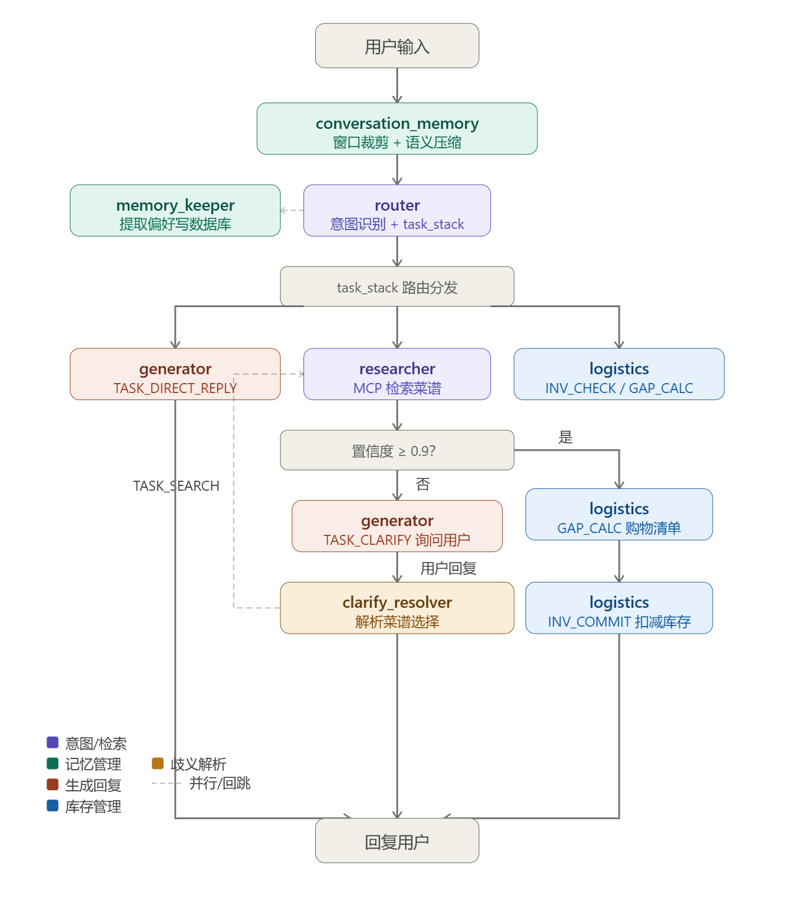

## **目录**

- 项目概述
- 核心特点
- 技术选型
- 测试方案
- 系统架构与模块设计
- 项目排期

## 1. **项目概述**

本项目旨在开发一个智能膳食管理 Agent，通过 **MCP Server** 模式集成专业的菜谱 RAG 知识库。该Agent助手深度集成了**多成员身份感知**、**长短期记忆解耦**以及**实时库存感知**能力，旨在为家庭用户提供极具个性化的菜谱推荐与后勤管理。

## 2. 核心特点

### **2.1 RAG 策略与设计亮点**

本项目在 RAG 链路的关键环节采用了经典的工程化优化策略，平衡了检索的查准率与查全率，具体思想如下：

- **分块策略 (Chunking Strategy)**：采用智能分块与上下文增强，为高质量检索打下基础。
  - **Markdown 结构化分块：**摒弃定长切分，利用 Markdown 标题层级（## 必备原料、## 操作）进行语义感知切分，确保烹饪步骤的完整性；
  - **上下文增强**：为 Chunk 注入文档元数据，确保检索时不仅匹配文本，还能感知上下文。
- **粗排召回 (Coarse Recall / Hybrid Search)**：采用 **混合检索** 策略作为第一阶段召回，快速筛选候选集。
  - 结合 **稀疏检索 (Sparse Retrieval/BM25)** 利用关键词精确匹配，解决专有名词查找问题；
  - 结合 **稠密检索 (Dense Retrieval/Embedding)** 利用语义向量，解决同义词与模糊表达问题；
  - 两者互补，通过 RRF (Reciprocal Rank Fusion) 算法融合，确保查全率与查准率的平衡。
- **精排重排 (Rerank / Fine Ranking)**：在粗排召回的基础上进行深度语义排序。
  - 采用 Cross-Encoder（专用重排模型）或 LLM Rerank（可选后端）对候选集进行逐一打分，识别细微的语义差异。
    - 通过 **"粗排(低成本泛召回) -> 精排(高成本精过滤)"** 的两段式架构，在不牺牲整体响应速度的前提下大幅提升 Top-Results 的精准度。

### **2.2 全链路可插拔架构 (Pluggable Architecture)**

鉴于 AI 技术的快速演进，本项目在架构设计上追求**极致的灵活性**，拒绝与特定模型或供应商强绑定。**整个系统**（不仅是 RAG 链路）的每一个核心环节均定义了抽象接口，支持"乐高积木式"的自由替换与组合：

- **LLM 调用层插拔 (LLM Provider Agnostic)**：

  - 核心推理 LLM 通过统一的抽象接口封装，支持**多协议**无缝切换：

    - **Azure OpenAI**：企业级 Azure 云端服务，符合合规与安全要求；
    - **OpenAI API**：直接对接 OpenAI 官方接口；
    - **本地模型**：支持 Ollama、vLLM、LM Studio 等本地私有化部署方案；
    - **其他云服务**：DeepSeek、Anthropic Claude 等第三方 API。

    通过配置文件一键切换后端，**零代码修改**即可完成 LLM 迁移，便于成本优化、隐私合规或 A/B 测试。

- **Embedding & Rerank 模型插拔 (Model Agnostic)**：
  - Embedding 模型与 Rerank 模型同样采用统一接口封装；
  - 支持云端服务（OpenAI Embedding, Cohere Rerank）与本地模型（Sentence-Transformers, BGE）自由切换。

- **RAG Pipeline 组件插拔**：
  - **Loader（解析器）**：支持 PDF、Markdown、Code 等多种文档解析器独立替换
  - **Smart Splitter（切分策略）**：语义切分、定长切分、递归切分等策略可配置；
  - **Transformation（元数据/图文增强逻辑）**：OCR、Image Captioning 等增强模块可独立配置。

- **检索策略插拔 (Retrieval Strategy)**：
  - 支持动态配置纯向量、纯关键词或混合检索模式；
  - 支持灵活更换向量数据库后端（如从 Chroma 迁移至 Qdrant、Milvus）。

- **评估体系插拔 (Evaluation Framework)**：
  - 评估模块不锁定单一指标，支持挂载不同的 Evaluator（如 Ragas, DeepEval）以适应不同的业务考核维度。

### 2.3 MCP 生态集成 (Copilot / ReSearch)

本项目的核心设计完全遵循 Model Context Protocol (MCP) 标准，这使得它不仅是一个独立的问答服务，更是一个即插即用的知识上下文提供者。

- **工作原理**：
  - 我们的 Server 作为一个 **MCP Server** 运行，暴露一组标准的 `tools` 和 `resources` 接口。
  - 任何兼容的**MCP Clients**（如 GitHub Copilot, ReSearch Agent, Claude Desktop 等）均可直接调用该“膳食知识库”server。
  - **无缝接入**：当你在 GitHub Copilot 中提问时，Copilot 作为一个 MCP Host，能够自动发现并调用我们的 Server 提供的工具（如 `search_documentation`），获取我们内置的私有文档知识，然后结合这些上下文来回答你的问题。
- **优势**：
  - **零前端开发**：无需为知识库开发专门的 Chat UI，直接复用开发者已有的编辑器（VS Code）和 AI 助手。
  - **上下文互通**：Copilot 可以同时看到你的代码文件和我们的知识库内容，进行更深度的推理。
  - **标准兼容**：任何支持 MCP 的 AI Agent（不仅是 Copilot）都可以即刻接入我们的知识库，一次开发，处处可用。

### 2.4 可观测性、可视化管理与评估体系 (Observability, Visual Management & Evaluation)

针对 RAG 系统常见的“黑盒”问题，本项目致力于让每一次生成过程都**透明可见**且**可量化**，并提供完整的**本地可视化管理平台**：

- **全链路白盒化 (White-box Tracing)**：
  - 记录并可视化 RAG 流水线的每一个中间状态：覆盖 Ingestion（加载→切分→增强→编码→存储）与 Query（查询预处理→Dense/Sparse 召回→融合→重排→响应构建）两条完整链路。
  - 开发者可以清晰看到“系统为什么选了这个文档”以及“Rerank 起了什么作用”，从而精准定位坏 Case。
- **可视化管理平台 (Visual Management Dashboard)**：
  - 基于 Streamlit 的本地 Web 管理面板，提供六大功能页面：
    - **系统总览**：展示当前可插拔组件配置（LLM/Embedding/Splitter/Reranker）与数据资产统计。
    - **数据浏览器**：查看已索引的文档列表、Chunk 详情（原文、metadata 各字段、关联图片），支持搜索过滤。
    - **Ingestion 管理**：通过界面选择文件触发摄取、实时展示各阶段进度、支持删除已摄入文档（跨 4 个存储的协调删除）。
    - **Query 追踪**：查询历史列表，耗时瀑布图，Dense/Sparse 召回对比，Rerank 前后排名变化。
    - **Ingestion 追踪**：摄取历史列表，各阶段耗时与处理详情。
    - **评估面板**：运行评估任务、查看各项指标、历史趋势对比。
  - 所有页面基于 Trace 中的 `method`/`provider` 字段**动态渲染**，更换可插拔组件后 Dashboard 自动适配，无需修改代码。
- **自动化评估闭环 (Automated Evaluation)**：
  - 集成 Ragas 等评估框架（可插拔），为每一次检索和生成计算“体检报告”（如召回率 Hit Rate、准确性 Faithfulness 等指标）。
  - 拒绝“凭感觉”调优，建立基于数据的迭代反馈回路，确保每一次策略调整（如修改 Chunk Size 或更换 Reranker）都有量化的分数支撑。

### 2.5 上下文记忆系统(Persistent Context)

本项目针对家庭多成员场景，设计了**分层持久化记忆系统**

- **多维度用户画像 (Layered User Profiling) ：**
  - **基础档案：** 存储多成员的生理指标（身高、体重、目标热量）与核心禁忌（过敏源、疾病忌口）。
  - **动态偏好：** 记录口味倾向（如：偏爱酸辣、拒绝香菜）和烹饪习惯（如：早晨通常只有10分钟准备时间）。
  - **显式身份校准 (Explicit Identity Alignment)：** 系统提供成员切换接口（支持 UI 按钮点击），允许用户主动校准当前身份。
  - **多成员冲突处理：** 当 Agent 为多人准备膳食时（如“做全家人的晚餐”），Logistics Manager 节点会自动执行 **Intersection (交集)** 逻辑
- **长短期记忆解耦 (Memory Decoupling)：**
  - **短期工作记忆 (Thread-based Memory)：** 基于 LangGraph 的 Checkpointer 机制，保留当前对话的上下文，支持“多加两瓶牛奶”等即时指令的追溯。
  - **长期语义记忆 (Semantic Long-term Memory)：** 由 **Memory Keeper** 节点定期将对话中的关键信息转化为结构化标签存入数据库，不随对话结束而丢失。
- **家庭共享库存感知 (Shared Inventory Awareness)：**
  - Agent 会持续追踪家庭库存的变动，在生成清单时自动抵扣剩余食材。
- **被动式提取机制 (Passive Extraction)：**
  - 无需用户手动设置，Agent 能够从自然对话中隐式学习。例如，当用户多次提到“最近牙齿不太好”时，Agent 会自动将“软烂易消化”标记为当前阶段的高优先级偏好。

### 2.6 Agent逻辑解耦

本项目将Agent的相关功能模块作为独立节点，并由一个**总控节点**进行**意图识别**激活对应节点：

- **Memory Keeper (记忆守护者):** 专门负责从对话中静默提取偏好，并更新数据库。它不直接回答用户，只负责维护“人设”。
- **Recipe Researcher (菜谱研究员):** 专门负责 MCP Server 的 RAG 检索，将 Markdown 转化为结构化数据。
- **Logistics Manager (后勤主管):** 专门负责库存比对和清单生成。

## 3. 技术选型

### 3.1 RAG 核心流水线设计

####  3.1.1 数据摄取流水线  

- **目标：** 构建统一、可配置且可观测的数据摄取流水线，覆盖Markdown文档加载、格式解析、语义切分、多模态增强、嵌入计算、去重与批量上载到向量存储。该能力应是可重用的库模块，便于在 `ingest.py`、Dashboard 管理面板、离线批处理和测试中调用。

- **自研 Pipeline 框架（设计灵感参考 LlamaIndex 分层思想，但不依赖 LlamaIndex 库）：**

  - 采用自定义抽象接口（`BaseLoader`/`BaseSplitter`/`BaseTransform`/`BaseEmbedding`/`BaseVectorStore`），实现完全可控的可插拔架构。
  - 支持可组合的 **Loader -> Splitter -> Transform -> Embed -> Upsert** 流程，便于实现可观测的流水线。
  - 与主流 embedding provider 有良好适配，架构中统一使用 Chroma 作为向量存储。

-   **设计要点（流水线分层概述）：**

  1. Loader：负责把原始文件解析为统一的 `Document` 对象

     - **统一输出格式**：直接读取 Markdown 文本，输出规范化的 `Document.text`。这为后续 `RecursiveCharacterTextSplitter` 识别标题层级提供基础。

     - **膳食业务元数据 (Metadata) 设计**：Loader 重点补齐以下字段，为 `Recipe Researcher` 和 `Logistics Manager` 提供决策依据：     

       （表1 元数据metadata设计）

       | 字段名称     | 数据类型  | 作用与业务逻辑说明                                           |
       | ------------ | --------- | ------------------------------------------------------------ |
       | recipe_id    | String    | 唯一标识符：关联 inventory.db 与原始文档的核心键，确保对账一致性。 |
       | chunk_id     | String    | 切片 ID：标识当前内容属于文档的哪一部分，支持“二段式检索”定位。 |
       | source_path  | String    | 溯源路径：本地 Markdown 文件路径或 URL。                     |
       | content_type | Enum      | 内容分类：标记该片段是 INGREDIENTS (食材)、STEPS (步骤) 还是 SUMMARY (摘要)。 |
       | restrictions | List[str] | 禁忌标签：如 ["含花生", "含麸质"]。用于匹配 active_constraints 执行安全一票否决。 |
       | dietary_tags | List[str] | 饮食属性：如 ["高蛋白", "低脂", "生酮"]。用于语义重排（Rerank）。 |
       | difficulty   | Enum      | 难度等级：如 简单, 中等, 极难。匹配用户烹饪水平画像。        |
       | score        | Float     | 匹配分值：记录检索时的相关度得分，供混合检索（RRF）融合使用。 |

  2. Splitter：基于 Markdown 结构（标题/段落/代码块等）与参数配置把 `Document` 切为若干 Chunk，保留原始位置与上下文引用。

  3. Transform：将非结构化文本转化为“智能切片”的关键环节，Transform 可以选择把额外信息追加到 `chunk.text` 或放入 `chunk.metadata`。

  4. Embed & Upsert：按批次计算 embedding，并上载到向量存储；支持向量 + metadata 上载，并提供幂等 upsert 策略（基于 id/hash）。

  5. Dedup & Normalize：在上载前运行向量/文本去重与哈希过滤，避免重复索引。   

- **关键实现要素（流水线每个要点详细要点）：**

  1. **Markdown Loader**：负责解析 `.md` 格式文件。系统会自动提取菜谱名称（H1）作为核心元数据，并保持文档的层级结构（Heading Outline）。

     - **前置哈希去重：**

       - **机制：** 在解析前，计算文件的 **SHA256** **指纹**并检索 `ingestion_history` 表。若 Hash 匹配且状态为 `success`，则则认定文件未变更，直接跳过后续处理，实现**零成本**的增量更新。

       - **存储方案**：     

       - **默认选择：** **SQLite**，存储于 `data/db/ingestion_history.db`       

       - **表结构**：

         ```sqlite
         CREATE TABLE ingestion_history (             
                 file_hash TEXT PRIMARY KEY,             
                 file_path TEXT NOT NULL,             
                 file_size INTEGER,             
                 status TEXT NOT NULL CHECK(status IN ('success', 'failed', 'processing')),
                 processed_at TIMESTAMP DEFAULT CURRENT_TIMESTAMP,
                 error_msg TEXT,             
                 chunk_count INTEGER         
         );         
         CREATE INDEX idx_status ON ingestion_history(status);         
         CREATE INDEX idx_processed_at ON ingestion_history(processed_at);  
         ```

       - **查询逻辑**：`SELECT status FROM ingestion_history WHERE file_hash = ? AND status = 'success'`          

       - **替换路径**：后续可升级为 Redis（分布式缓存）或 PostgreSQL（企业级中心化存储）

     - **BM25 索引元数据：**

       - **机制：关键词频率对账** 在摄取阶段，对文本进行分词处理，并计算词频（TF）、逆文档频率（IDF）及文档长度（dl）。利用 **SQLite** **FTS5** 插件构建倒排索引，确保在搜索特定食材名称（如“老抽”vs“生抽”）时具备比语义向量更高的精准度。

       - **存储方案：**

         - **默认选择：** **SQLite** **(FTS5 扩展)**，存储于 `data/db/bm25_index.db`

         - **表结构：**

       
         ```sqlite
         -- 1. 全文搜索虚表：存储原始文本并自动分词
         CREATE VIRTUAL TABLE recipe_fts USING fts5(
             content,              -- 菜谱切片文本内容
             recipe_id UNINDEXED,  -- 关联业务 ID (不参与分词索引)
             tokenize='unicode61'  -- 推荐使用支持中文的分词器插件（如 jieba）
         );
         
         -- 2. 统计辅助表：存储 BM25 公式所需的计算参数
         CREATE TABLE bm25_stats (
             recipe_id TEXT PRIMARY KEY,
             doc_len INTEGER,      -- 该切片的总词数 (dl)
             file_hash TEXT,       -- 关联文件指纹，支持同步删除
             FOREIGN KEY(recipe_id) REFERENCES recipe_fts(recipe_id)
         );
         
         -- 3. 全局参数表：维护语料库级权重
         CREATE TABLE global_params (
             id INTEGER PRIMARY KEY CHECK (id = 1),
             avg_dl REAL,          -- 全库平均文档长度 (avgdl)
             total_docs INTEGER    -- 库中切片总数 (N)
         );
         ```
       
       - **查询逻辑：**
       
         ```sqlite
         -- 使用 FTS5 内置的 bm25() 函数进行排名计算
         SELECT recipe_id, bm25(recipe_fts) AS rank_score 
         FROM recipe_fts 
         WHERE content MATCH ? 
         ORDER BY rank_score ASC 
         LIMIT 10;	
         ```
       
         
       
       - > **📌 持久化存储架构统一说明**
         >
         > 本项目在多个核心模块中采用 **SQLite** 作为轻量级持久化存储方案，避免引入重量级数据库依赖，保持本地优先（Local-First）的设计理念：
         >
         > | **存储模块**        | **数据库文件**                 | **用途**                                    | **表结构关键字段**                    |
         > | :------------------ | :----------------------------- | :------------------------------------------ | :------------------------------------ |
         > | **文件完整性检查**  | `data/db/ingestion_history.db` | 记录已处理文件的 SHA256 哈希，实现增量摄取  | `file_hash`, `status`, `processed_at` |
         > | **BM25 索引元数据** | `data/db/bm25_index.db`        | 存储倒排索引(表`recipe_fts`)和 IDF 统计信息 |                                       |
       
       - 输出标准`Document`:`id|source|text(markdown)|metadata`     
       
         具体如（表1 元数据metadata设计）所示
       
       - Loader不负责切分：只做“格式统一 + 结构抽取 + 引用收集”，确保切分策略可独立迭代与度量。
  
  2. **Splitter：** 将 Loader 产出的标准化 Markdown 文档切分为具备完整语义、且携带全局业务特征的智能切块
  
     - **实现方案：** 使用 LangChain 的 `RecursiveCharacterTextSplitter` 进行切分。
       - **优势：** 该方法对 Markdown 文档的结构（标题、段落、列表）有天然适配性，能通过配置 `Separators`（如 `["\n# ", "\n## ", "\n### ", "\n\n", "\n"]`）实现高质量、语义不破碎的切块。
       - **Splitter输入：** 由 Loader 产出的规范化 `Document` 对象（含文本及初步抽取的原料、标签等元数据）。
       - **Splitter输出：** 若干 `Chunk`，每个 chunk 必须携带稳定的定位信息与来源信息：`source`（源文件名）, `chunk_index`, `heading_context`：该片段所属的最近一级标题名称（如“操作步骤”）。
     - **核心机制：** 元数据透传与确定性标识，Splitter在切分过程中必须执行以下两点关键操作：
       1. **全局业务信息透传 (Global Metadata Retention)**
          - **操作逻辑**：Loader 阶段提取的全局元数据（如 `ingredients` 结构化列表、`tags` 口味工艺、`difficulty` 难度等级）必须**全量复制**到该文档产出的每一个 Chunk 中。
          - **目的：** 确保检索阶段即便只命中了一个“操作步骤”的片段，Agent 也能通过透传的元数据获知该菜品的完整原料和属性，从而在 `Memory Keeper` 节点进行实时偏好匹配（例如：检测该步骤所属菜品是否包含过敏原）。
       2. **确定性唯一标识生成 (Deterministic ID Generation)**：
          - **操作逻辑**：为每个 Chunk 生成全局唯一的 `chunk_id`，生成算法采用确定的哈希组合：**`hash(source_path + chunk_index)`**。
          - **目的 (幂等性)**：确保同一文档即使被多次处理，数据库中也永远只有一份最新的唯一副本，彻底避免索引冗余。
          - **业务支撑**：当 `Logistics Manager` 节点在更新家庭库存或进行比例换算时，稳定的 ID 能确保 Agent 能够精准定位并引用知识库中的特定逻辑块. 
  
  3. **Transform：** 将 Splitter 产出的非结构化文本块转化为结构化、富语义的智能切片 (Smart Chunk)
  
     - **结构转换：** 利用LLM将原始的字符串文本转化为强类型的记录对象（Record/Object）
     - **核心增强策略：**
       1. 智能重组与去噪：
          - **策略：** 合并在逻辑上紧密相关但被物理切断的段落，剔除无意义的页眉页脚或乱码（去噪），确保每个 Chunk 是自包含（Self-contained）的语义单元。
       2. 语义元数据注入：
          - **策略：** 在原始文件路径等基础信息之上，利用 LLM 提取更高维度的语义特征 。为每个 Chunk 自动生成 `Title`（精准小标题）、`Summary`（内容摘要）和 `Tags`（主题标签），并将其注入到 Metadata 字段中，支持后续的混合检索与精确过滤。
     - **工程特征：**
       - **原子化与幂等：**每个 Chunk 的处理要么完全成功，要么不改变状态，且多次处理结果一致，防止数据库产生冗余重复信息。
       - **独立重试机制**：支持针对特定 Chunk 的独立重试。如果某个 Chunk 因为 LLM 调用失败（如网络抖动），系统会自动重试该 Chunk，而不会导致整个文档的摄取中断。
  
  4.  **Embedding：** 将经过 **Transform** 增强后的智能切片（Smart Chunk）转为Embedding。系统采用双路编码策略，以兼顾膳食检索中的“语义泛化”与“精确匹配”需求。
  
     - **差量计算 (Incremental Embedding / Cost** **Optimization****)**：**
     - **策略：** 在调用昂贵的 Embedding API 之前，计算 Chunk 的内容哈希（Content Hash）。系统仅针对数据库中不存在的新内容哈希执行向量化计算，对于文件名变更但内容未变的片段，直接复用已有向量，显著降低 API 调用成本。
     - **核心策略**：为了支持高精度的混合检索（Hybrid Search），系统对每个 Chunk 并行执行双路编码计算。
       - **Dense Embeddings（语义向量）**：调用 Embedding 模型（如 OpenAI text-embedding-3 或 BGE）生成高维浮点向量，捕捉文本的深层语义关联，解决“词不同意同”的检索难题。
       - **Sparse** **Embeddings（稀疏向量）**：利用 BM25 编码器生成稀疏向量（Keyword Weights），捕捉精确的关键词匹配信息，解决专有名词查找问题。    
       -  **批处理优化**：所有计算均采用 `batch_size`驱动的批处理模式，最大化 CPU 利用率并减少网络 RTT。 
  
  5. **Upsert & Storage：**统一使用向量**数据库Chroma**作为存储引擎，持久化存储 Dense Vector、富元数据 (Rich Metadata) 以及 Chunk 的原始文本。
  
     - **All-in-One 存储策略**：执行原子化存储，每条记录同时包含：
  
       1. **Index Data**: 用于计算相似度的 Dense Vector。
  
       2. **Payload Data**: 包含完整的 Chunk 原始文本 (Content) 、Sparse Vector（以元数据形式或权重列表存储）及 Transform 阶段生成的结构化元数据。
  
       - **机制优势**：能立即取回所有结构化信息进行后勤换算（如食材总量统计），无需二次查询其他数据库（Lookup），保障了检索阶段响应速度。
  
     - **幂等性设计 (Idempotency)**：
  
       - 为每个 Chunk 生成全局唯一的 `chunk_id`，生成算法采用确定的哈希组合：`hash(source_path + section_path + content_hash)`。
       - 写入时采用 "Upsert"（更新或插入）语义，确保同一文档即使被多次处理，数据库中也永远只有一份最新副本，彻底避免重复索引问题。
  
     - **原子性保证**：以 Batch 为单位进行事务性写入，确保索引状态的一致性。
  
  6. **文档生命周期管理：** 为了支持 Dashboard 管理面板中的菜谱浏览、删除以及实时摄取监控，系统必须具备跨模块的协调能力（`Ingestion`层）
  
     - **DocumentManager（文档管理器）**：独立于 Ingestion Pipeline 的文档管理模块（`src/ingestion/document_manager.py`），负责协调不同存储后端的操作，确保“数据删除即全链路抹除” 。
  
       - **`list_documents()`**：列出已摄入的菜谱清单。 
         -  **适配点**：展示菜谱的业务信息，如：Chunk 总数、提取出的食材项数、烹饪难度标签。
       - **`get_document_detail(doc_id)`**：获取单个菜谱的详细知识切片。     
         - **适配点**：展示该菜谱下所有的 Smart Chunks，包括 LLM 生成的摘要和结构化食材 JSON。
       - **`delete_document(source_path)`**：
         - **核心逻辑**。协调删除跨 **3 个存储**的关联数据：
           1. **Chroma**：根据 `metadata.source` 批量删除该菜谱的所有向量切片。
           2. **BM25 Indexer**：移除对应菜谱的关键词倒排索引条目，确保通过食材名搜不到已删菜谱。
           3. **FileIntegrity (SQLite)**：从 `ingestion_history` 表中移除 SHA256 记录，允许用户在修改该 Markdown 文件后重新摄入。
  
     - **Pipeline 进度回调 (Progress Callback)：** 为了解决摄取过程中的“黑盒”问题，`IngestionPipeline` 需提供钩子函数，供 Streamlit 前端展示实时动态。
  
       ```python
       def run(self, source_path: str, collection: str = "default",
                   on_progress: Callable[[str, int, int], None] | None = None)
                    -> IngestionResult:
       ```
  
       - **回调签名**：`on_progress(stage_name: str, current: int, total: int)`
       - **关键阶段监控**：针对 Markdown 链路，Dashboard 会实时更新以下阶段的进度条：
         - **Load**：读取并验证 Markdown 格式。
         - **Split**：按照标题层级完成语义切分。
         - **Transform**：**最耗时阶段**，展示 LLM 正在提取食材标签和生成摘要的进度。
         - **Embed & Upsert**：向量化计算并存入 Chroma 的进度。
  
     - **存储层接口扩展：** 为支持 `DocumentManager` 的删除操作，需扩展以下存储接口：
  
       - `BaseVectorStore` 新增 `delete_by_metadata(filter: dict) -> int` — 按 metadata 条件批量删除;
       - `BM25Indexer` 新增 `remove_document(source: str) -> None` — 移除指定文档的索引条目;
       - `FileIntegrityChecker` 新增 `remove_record(file_hash: str) -> None` 和 `list_processed() -> List[dict]`

####  3.1.2 检索流水线  

**目标：** 实现核心的 RAG 检索引擎，采用 “多阶段过滤 (Multi-stage Filtering)” 架构，负责接收已消歧的独立查询（Standalone Query），并精准召回 Top-K 最相关片段。

- **Query** **Processing (查询预处理)**

  - **核心假设：**系统假设输入的 Query 已由上游 Agent 节点（Clarify）完成了会话**上下文补全和指代消歧**：例如，当用户问“怎么做它？”时，进入检索流水线的 Query 应已被改写为“怎么做[红烧鲤鱼]？”，消除代词歧义。

  - **查询转换与关键词提取：**

    - **策略：** 利用膳食领域专用的 NLP 工具或 LLM 轻量级调用，提取 Query 中的关键实体。

    - **操作：**     

      **食材提取**：识别 Query 中的核心食材（如“鲤鱼”、“五花肉”）。 

      **工艺识别**：提取烹饪动词（如“烧”、“炸”、“焖”）。    

      **禁忌/偏好识别**：提取关键属性词（如“低盐”、“过敏原：鱼”）。

      **去停用词：** 移除无意义的助词，生成用于稀疏检索（BM25）的精简 Token 列表。

  - **查询扩展：** 针对膳食知识中 **“一物多名”** 的特点，实施差异化扩张策略

    - **Synonym/Alias Expansion (同义词/别名扩展)**：     

      例如：

      食材别名：如“番茄”与“西红柿”、“马铃薯”与“土豆”。      

      工艺关联：如“红烧”关联“烧”、“焖”、“煮”。

    - **执行逻辑：**

      - **Sparse Route (BM25 路由)：** 将“原始关键词 + 同义词/别名”合并为一个逻辑查询表达式（按 `OR` 关系扩展）。 为防止语义漂移，**原始关键词被赋予更高权重**。
      - **Dense Route (Embedding 路由)**：使用原始 query（或轻度改写后的语义 query）生成 embedding，**只执行一次稠密检索**；默认不为每个同义词单独触发额外的向量检索请求。 

- **Hybrid Search Execution (双路混合检索)：** 将来自不同维度的检索结果进行融合，解决单一检索模式在处理专有名词与模糊语义的局限性

  - **并行召回 (Parallel Execution)**：系统接收到预处理后的查询请求后，同时触发两条召回路径
    - **Dense Route**：计算 Query Embedding -> 检索向量库（Cosine Similarity）-> 返回 Top-N 语义候选。
    - **Sparse** **Route**：使用 BM25 算法 -> 检索倒排索引 -> 返回 Top-N 关键词候选。
  - **结果融合 (Fusion)**：
    - 采用 **RRF (Reciprocal Rank Fusion)** 算法，基于排名的倒数进行加权融合。
    - 公式策略：`Score = 1 / (k + Rank_Dense) + 1 / (k + Rank_Sparse)`，平滑因单一模态缺陷导致的漏召回。 

- **Filtering & Reranking (精确过滤与重排)：** 在混合检索召回的初步候选集基础上，执行业务级的硬约束过滤与深度语义重排

  - **Metadata Filtering Strategy (元数据过滤策略)**：  

    **原则：** 先解析、能前置则前置、无法前置则后置兜底。

    - **前置硬过滤 ：** Query Processing 阶段，Agent将用户身份对应的禁忌转化为结构化过滤条件。若底层Chroma支持且字段完整，在 Dense/Sparse 检索阶段做 Pre-filter 直接排除包含禁忌食材（`ingredients`字段）的菜谱。
    - **后置安全过滤：** 对于元数据缺失或检索阶段不支持的复杂逻辑，在 Rerank 之前，对召回的 Chunk 进行二次检查。对于缺失禁忌字段的 Chunk，默认采取“宽松包含”以避免误杀，对缺失字段默认采取“宽松包含”(missing->include) 以避免误杀召回。
    - **软偏好加权：** 对于口味倾向（酸辣）、烹饪习惯等软偏好（Soft Preference）不进行硬性剔除，而是在 Rerank 阶段作为评分信号。例如，用户偏好“酸辣”，则在重排时给带有“酸辣”标签（`tags`）的菜谱更高权重。

  - **Rerank Backend (可插拔精排后端)**：   

    **目标：** 在 混合检索给出的 Top-M 候选上进行高精度排序/过滤；该模块必须可关闭，并提供稳定回退策略

    - **后端选项**：
      1. **None (关闭精排)**：在资源受限时，直接返回 **RRF** 融合后的排名结果。
      2. **Cross-Encoder Rerank (默认)**：将 [用户查询, 菜谱片段] 对输入 Cross-Encoder 模型（如 BGE-Reranker），输出相关性分数并排序；适合稳定、结构化输出。CPU 环境下建议默认仅对较小的 Top-M 执行（例如 M=10~30），并提供超时回退。
      3. **LLM** **Rerank (可选)**：利用 LLM 的指令理解能力，根据复杂的家庭需求（如“给生病的孩子做点软烂的”）对候选集进行排序。要求输出严格的 JSON 格式评分。
    - **可靠性保证** ：
      - **默认回退(Fallback)**：当精排后端发生超时、API 失败或逻辑异常时，系统必须自动回退至融合阶段的 **RRF Top-K** 结果，确保 Agent 始终有内容可用，避免服务中断。

### 3.2 MCP 服务设计

 **目标：**使用**Python 官方** **MCP** **SDK (**`mcp`)，设计并实现一个符合 Model Context Protocol (MCP) 规范的 Server，通过标准化的 **Tools** 和 **Resources**使该膳食 RAG 能够作为知识上下文提供者，无缝对接主流 MCP Clients

####   3.2.1 核心设计理念

- **协议优先 (Protocol-First)**：严格遵循 MCP 官方规范（JSON-RPC 2.0），确保与任何合规 Client 的互操作性。
- **开箱即用 (Zero-Config for Clients)**：Client 端采用动态发现机制，无需任何特殊配置，只需在配置文件中添加 Server 连接信息即可使用全部功能。
- **引用透明 (Citation Transparency)**：所有检索结果必须携带完整的来源信息，支持 Client 端展示"回答依据"，增强用户对 AI 输出的信任。
- **能力原子化(Atomic Capabilities)：** 不输出模糊的整篇菜谱，而是提供原子级的工具（如：获取清单、获取步骤、检查禁忌）。

####  3.2.2 传输协议：Stdio本地通信

 本项目采用 **Stdio Transport** 作为唯一通信模式。

- **工作方式：**Client以子进程方式启动我们的Server，双方通过标准输入/输出交换JSON-RPC消息。
- **实现约束：**
  - `stdout` 仅输出合法 MCP 消息，禁止混入任何日志或调试信息。
  - 日志统一输出至 `stderr`，避免污染通信通道。

####  3.2.3 对外暴露的工具接口设计

- Server 通过 `tools/list` 向 Client 注册可调用的工具函数。工具设计应遵循"单一职责、参数明确、输出丰富"原则。

- | 工具名称             | 功能描述                                         | 核心输入参数                                 | 膳食业务价值                                                 |
  | -------------------- | ------------------------------------------------ | -------------------------------------------- | ------------------------------------------------------------ |
  | search_recipes       | 执行混合检索 + 业务过滤，返回匹配的菜谱片段。    | query: string, filters: object, top_k: int   | 支持 {"exclude": ["花生"], "difficulty": "easy"} 等硬约束过滤。 |
  | get_recipe_details   | 获取指定菜谱的完整 Markdown 内容及结构化食材表。 | recipe_name: string                          | 提供烹饪所需的全量步骤与精准配比，而不仅仅是片段。           |
  | list_dietary_tags    | 列出库中现有的所有口味、工艺、健康标签。         | 无                                           | 让 AI 助手知道可以从哪些维度（如：高蛋白、生酮）来筛选菜谱。 |
  | check_dietary_safety | 针对输入菜谱进行过敏原与偏好匹配预警。           | recipe_content: string, user_profile: object | 在正式推荐前，做最后一步的安全性“强校验”。                   |

####  3.2.4 膳食MCP Server 返回内容设计

 MCP 协议允许在 `content` 数组中同时返回多种类型的数据。我们将充分利用这一特性，实现“**人类可读 + 机器可算 + 溯源透明**”的返回结构。

 MCP响应结果，在 `content[0].text` 中返回一个**JSON****字符串，**包含以下逻辑：

| 字段名  | 类型         | 备注                                                         |
| ------- | ------------ | ------------------------------------------------------------ |
| answer  | String       | 全局摘要：对本次搜索结果的概括（如：“为您找到 3 个符合清淡要求的菜谱...”）。 |
| results | List[Object] | 候选列表：核心变更点。将每个 Chunk 包装成独立的“业务包”。    |

 而`results`列表中包含以下三个子字段名：

| 子字段名           | 类型   | 备注                                                       |
| ------------------ | ------ | ---------------------------------------------------------- |
| content_text       | String | 该切片的原始文本内容。                                     |
| metadata           | Object | 该切片特有的元数据（ID、安全禁忌、匹配分值、来源路径）。   |
| structured_payload | Object | 该切片关联的业务数据（完整归一化食材清单、份量、营养值）。 |

 其中，Structured Payload所包含的字段如下：

| 字段名称       | 数据类型   | 作用与业务逻辑说明                                           |
| -------------- | ---------- | ------------------------------------------------------------ |
| dish_name      | String     | 标准菜名：用于展示和在 inventory.db 中标记扣减记录。         |
| servings       | Integer    | 建议份量：该配方的基准人数。Logistics 节点据此等比缩放食材用量。 |
| ingredients    | List[Dict] | 食材清单：包含 item、amount、unit。核心字段：驱动后勤缺口计算 $R - I$。 |
| flavor_profile | List[str]  | 口味特征：如 ["酸辣", "清淡"]。用于与用户长期偏好对齐。      |
| steps_summary  | List[str]  | 步骤摘要：核心步骤的简述，供 Response Generator 在生成简报时使用。 |
| is_normalized  | Boolean    | 单位归一化标志：标记食材用量是否已通过 Unit Converter 转换为基准单位。 |

metadata所包含的字段如下表：

| 字段名称     | 数据类型  | 作用与业务逻辑说明                                           |
| ------------ | --------- | ------------------------------------------------------------ |
| recipe_id    | String    | 唯一标识符：关联 inventory.db 与原始文档的核心键，确保对账一致性。 |
| chunk_id     | String    | 切片 ID：标识当前内容属于文档的哪一部分，支持“二段式检索”定位。 |
| source_path  | String    | 溯源路径：本地 Markdown 文件路径或 URL。                     |
| content_type | Enum      | 内容分类：标记该片段是 INGREDIENTS (食材)、STEPS (步骤) 还是 SUMMARY (摘要)。 |
| restrictions | List[str] | 禁忌标签：如 ["含花生", "含麸质"]。用于匹配 active_constraints 执行安全一票否决。 |
| dietary_tags | List[str] | 饮食属性：如 ["高蛋白", "低脂", "生酮"]。用于语义重排（Rerank）。 |
| difficulty   | Enum      | 难度等级：如 简单, 中等, 极难。匹配用户烹饪水平画像。        |
| score        | Float     | 匹配分值：记录检索时的相关度得分，供混合检索（RRF）融合使用。 |

### 3.3 可插拔架构设计

 **目标：** 定义清晰的抽象层与接口契约，使 RAG 链路的每个核心组件都能够独立替换与升级，避免技术锁定，支持低成本的 A/B 测试与环境迁移。

####  3.3.1 设计原则

- **接口隔离 (Interface Segregation)**：为每类组件定义最小化的抽象接口，上层业务逻辑仅依赖接口而非具体实现。
- **配置驱动 (Configuration-Driven)**：通过统一配置文件（如 `settings.yaml`）指定各组件的具体后端，代码无需修改即可切换实现。
- **工厂模式** **(Factory Pattern)**：使用工厂函数根据配置动态实例化对应的实现类，实现"一处配置，处处生效"。
- **优雅降级 (Graceful Fallback)**：当首选后端不可用时，系统应自动回退到备选方案或安全默认值，保障可用性。

####  3.3.2 通用结构示意

```JSON
业务代码
  │
  ▼
<Component>Factory.get_xxx()  ← 读取配置，决定用哪个实现
  │
  ├─→ ImplementationA()
  ├─→ ImplementationB()  
  └─→ ImplementationC()
      │
      ▼
    都实现了统一的抽象接口
```

####  3.3.3 LLM 与 Embedding 的provider抽象

 这是可插拔设计的核心环节，因为模型提供者的选择直接影响成本、性能与隐私合规。

- **统一接口层 (Unified** **API** **Abstraction)**：

  - **设计思路**：无论底层使用 Azure OpenAI、OpenAI 原生 API、DeepSeek 还是本地 Ollama，上层调用代码应保持一致。
  - **关键抽象**：
    - `LLMClient`：暴露 `chat(messages) -> response` 方法，屏蔽不同 Provider 的认证方式与请求格式差异。
    - `EmbeddingClient`：暴露 `embed(texts) -> vectors` 方法，统一处理批量请求与维度归一化。

- **Provider 选项与切换场景**：

  - | 提供者类型           | 典型场景                           | 配置切换点                                          |
    | -------------------- | ---------------------------------- | --------------------------------------------------- |
    | Azure OpenAI         | 企业合规、私有云部署、区域数据驻留 | provider: azure, endpoint, api_key, deployment_name |
    | OpenAI 原生          | 通用开发、最新模型尝鲜             | provider: openai, api_key, model                    |
    | DeepSeek / 其他云端  | 成本优化、特定语言优化             | provider: deepseek, api_key, model                  |
    | Ollama / vLLM (本地) | 完全离线、隐私敏感、无 API 成本    | provider: ollama, base_url, model                   |

- **技术选型建议**：

  - 本项目采用自研的 `BaseLLM` / `BaseEmbedding` 抽象基类，配合工厂模式（`llm_factory.py` / `embedding_factory.py`）实现统一调用接口。已内置 Azure OpenAI、OpenAI、Ollama、DeepSeek 四种 Provider 适配。
  - 对于其他 Provider，可通过 **OpenAI-Compatible 模式**接入（设置自定义 `api_base`），或实现 `BaseLLM` 接口并在工厂中注册。

####  3.3.4 检索策略抽象

- 设计模式：抽象工厂模式，结构如“通用结构示意”所示，检索层各组件的可插拔性同样依赖两层设计：

  - **自研的统一抽象接口**：本项目为向量数据库（`BaseVectorStore`）、Embedding（`BaseEmbedding`）、分块（`BaseSplitter`）等核心组件定义了统一的抽象基类，不同实现只需遵循相同接口即可无缝替换。
  - **工厂函数路由**：每个抽象层配套工厂函数（如 `embedding_factory.py`、`splitter_factory.py`），根据 `settings.yaml` 中的配置字段自动实例化对应实现，实现"改配置不改代码"的切换体验。

- 各个组件应用该模式**详细描述**：

  1. **分块策略**
     - 分块是 Ingestion Pipeline 的核心环节之一，决定了文档如何被切分为适合检索的语义单元。本项目的 Splitter 层采用可插拔设计（BaseSplitter 抽象接口 + SplitterFactory 工厂），不同分块实现只需遵循相同接口即可无缝替换。

     本项目当前采用 **LangChain 的** **`RecursiveCharacterTextSplitter`** 进行切分。
     
     >**当前实现说明**：目前系统使用 LangChain RecursiveCharacterTextSplitter。架构设计上预留了切换能力，如需切换为 SentenceSplitter、SemanticSplitter 或自定义切分器，只需实现 BaseSplitter 接口并在配置中指定即可。
     
  2. **向量数据库**
     - 本项目自定义了统一的 BaseVectorStore 抽象接口，暴露 .add()、.query()、.delete() 等方法。所有向量数据库后端（Chroma、Qdrant、Pinecone 等）只需实现该接口即可插拔替换，通过 `VectorStoreFactory` 根据配置自动选择具体实现。
     
     本项目选用 **Chroma** 作为向量数据库.
     
     > **当前实现说明**：目前系统仅实现了 Chroma 后端。虽然架构设计上预留了工厂模式以支持未来扩展，但当前版本尚未实现其他向量数据库的适配器。
     
  3. **向量编码策略**
  
     - 向量编码是 Ingestion Pipeline 的关键环节，决定了 Chunk 如何被转换为可检索的向量表示。本项目自定义了 BaseEmbedding 抽象接口（src/libs/embedding/base.py），支持不同 Embedding 模型的可插拔替换。
  
     本项目当前采用 **双路编码（Dense + Sparse）** 策略：
  
     - **Dense Embeddings（语义向量）**：调用 Embedding 模型（如 OpenAI text-embedding-3）生成高维浮点向量，捕捉文本的深层语义关联。
  
     - **Sparse** **Embeddings（稀疏向量）**：利用 BM25 编码器生成稀疏向量（Keyword Weights），捕捉精确的关键词匹配信息。
     - 存储时，Dense Vector 和 Sparse Vector 与 Chunk 原文、Metadata 一起原子化写入向量数据库，确保检索时可同时利用两种向量。

     > **当前实现说明**：目前系统实现了 Dense + Sparse 双路编码。架构设计上预留了切换能力，如需使用其他 Embedding 模型（如 BGE、Ollama 本地模型）或调整编码策略，可在 Pipeline 中替换相应组件。

  4. **召回策略**

     - 召回策略决定了查询阶段如何从知识库中检索相关内容。

     本项目当前采用 **混合召回 + 精排（Hybrid + Rerank）** 策略：
  
     - **稠密召回（Dense Route）**：计算 Query Embedding，在向量库中进行 Cosine Similarity 检索，返回 Top-N 语义候选。
  
     - **稀疏召回（****Sparse** **Route）**：使用 BM25 算法检索倒排索引，返回 Top-N 关键词候选。
  
     - **融合（Fusion）**：使用 RRF (Reciprocal Rank Fusion) 算法将两路结果合并排序。
  
     - **精排（Rerank）**：对融合后的候选集进行重排序，支持 None / Cross-Encoder / LLM Rerank 三种模式。
  
     > **当前实现说明**：目前系统实现了 Hybrid + Rerank 策略。架构设计上预留了策略切换能力，如需使用纯稠密或纯稀疏召回，可通过配置切换；融合算法和 Reranker 同样支持替换。

####  3.3.5 评估框架抽象

- **设计思路**：

  - 定义统一的 `Evaluator` 接口，暴露 `evaluate(query, retrieved_chunks, generated_answer, ground_truth) -> metrics` 方法。
  - 各评估框架实现该接口，输出标准化的指标字典。

- **可选评估框架**：

  - | 框架       | 特点                                                         | 适用场景                          |
    | ---------- | ------------------------------------------------------------ | --------------------------------- |
    | Ragas      | RAG 专用、指标丰富（Faithfulness, Answer Relevancy, Context Precision 等） | 全面评估 RAG 质量、学术对比       |
    | DeepEval   | LLM-as-Judge 模式、支持自定义评估标准                        | 需要主观质量判断、复杂业务规则    |
    | 自定义指标 | Hit Rate, MRR, Latency P99 等基础工程指标                    | 快速回归测试、上线前 Sanity Check |

- **组合与扩展**：

  - 评估模块设计为**组合模式**，可同时挂载多个 Evaluator，生成综合报告。
  - 配置示例：`evaluation.backends: [ragas, custom_metrics]`，系统并行执行并汇总结果。

### 3.4 可视化管理平台设计

- **目标：** 针对 RAG 系统常见的"黑盒"问题，设计全链路可观测的追踪体系与完整的可视化管理平台。覆盖 **Ingestion（摄取链路）** 与 **Query（查询链路）** 两条完整流水线的追踪记录，同时提供数据浏览、文档管理、组件概览等管理功能，使整个系统**透明可见**、**可管理**且**可量化**。

####  3.4.1 设计理念

- **双链路全覆盖追踪 (Dual-Pipeline Tracing)**：
  - **Ingestion Trace**：以 `trace_id` 为核心，记录一次摄取从文件加载到存储完成的全过程（load → split → transform → embed → upsert），包含各阶段耗时、处理的 chunk 数量、跳过/失败详情。
  - **Query** **Trace**：以 `trace_id` 为核心，记录一次查询从 Query 输入到 Response 输出的全过程（query_processing → dense → sparse → fusion → rerank），包含各阶段候选数量、分数分布与耗时。
- **透明可回溯 (Transparent & Traceable)**：每个阶段的中间状态都被记录，开发者可以清晰看到"系统为什么召回了这些文档"、"Rerank 前后排名如何变化"，从而精准定位问题。
- **低侵入性 (Low Intrusiveness)**：追踪逻辑与业务逻辑解耦，通过 `TraceContext` 显式调用模式注入，避免污染核心代码。
- **轻量本地化 (Lightweight & Local)**：采用结构化日志 + 本地 Dashboard 的方案，零外部依赖，开箱即用。
- **动态组件感知 (Dynamic Component Awareness)**：Dashboard 基于 Trace 中的 `method`/`provider`/`details` 字段动态渲染，更换可插拔组件后自动适配展示内容，无需修改 Dashboard 代码。

####  3.4.2 追踪数据结构

 系统定义两类 Trace 记录，分别覆盖查询与摄取两条链路：

1. **查询追踪（Query Trace）：**每次查询请求生成唯一的 `trace_id`，记录从 Query 输入到 Response 输出的全过程：

   - **基础信息**：

     - trace_id`：请求唯一标识

     - `trace_type`：`"query"`

     - `timestamp`：请求时间戳

     - `user_query`：用户原始查询

     - `collection`：检索的知识库集合

   - **各阶段详情 (Stages)**：

     | 阶段             | 记录内容                                                     |
     | ---------------- | ------------------------------------------------------------ |
     | Query Processing | 原始 Query、改写后 Query（若有）、提取的关键词、method、耗时 |
     | Dense Retrieval  | 返回的 Top-N 候选及相似度分数、provider、耗时                |
     | Sparse Retrieval | 返回的 Top-N 候选及 BM25 分数、method、耗时                  |
     | Fusion           | 融合后的统一排名、algorithm、耗时                            |
     | Rerank           | 重排后的最终排名及分数、backend、是否触发 Fallback、耗时     |

   - **汇总指标**：
  - `total_latency`：端到端总耗时
     - `top_k_results`：最终返回的 Top-K 文档 ID
  - `error`：异常信息（若有）
   - **评估指标 (Evaluation Metrics)**：
  - `context_relevance`：召回文档与 Query 的相关性分数
     - `answer_faithfulness`：生成答案与召回文档的一致性分数（若有生成环节）

2. **摄取追踪（Ingestion Trace）：**每次文档摄取生成唯一的 `trace_id`，记录从文件加载到存储完成的全过程

   - **基础信息**：

     - `trace_id`：摄取唯一标识
   
     - `trace_type`：`"ingestion"`
   
     - `timestamp`：摄取开始时间

     - `source_path`：源文件路径

     - `collection`：目标集合名称
   
   - **各阶段详情 (Stages)**：
   
     | 阶段      | 记录内容                                                     |
     | --------- | ------------------------------------------------------------ |
     | Load      | 文件大小、解析器（method: markitdown）、提取的图片数、耗时   |
     | Split     | splitter 类型（method）、产出 chunk 数、平均 chunk 长度、耗时 |
     | Transform | 各 transform 名称与处理详情（refined/enriched/captioned 数量）、LLM provider、耗时 |
     | Embed     | embedding provider、batch 数、向量维度、dense + sparse 编码耗时 |
     | Upsert    | 存储后端（method: chroma）、upsert 数量、BM25 索引更新、图片存储、耗时 |
   
   - **汇总指标**：
   
     - `total_latency`：端到端总耗时
   
     - `total_chunks`：最终存储的 chunk 数量
     - `total_images`：处理的图片数量
     - `skipped`：跳过的文件/chunk 数（已存在、未变更等）
     - `error`：异常信息（若有）

####  3.4.3 技术方案：结构化日志+本地 Web Dashboard

 本项目采用 **"结构化日志 + 本地 Web Dashboard"** 作为可观测性的实现方案。

  **实现架构**：

```Plain
RAG Pipeline
    │   
    ▼
Trace Collector (装饰器/回调)
    │
    ▼
JSON Lines 日志文件 (logs/traces.jsonl)
    │
    ▼
本地 Web Dashboard (Streamlit)
    │
    ▼
按 trace_id 查看各阶段详情与性能指标
```

**核心组件**：

- **结构化日志层**：基于 Python `logging` + JSON Formatter，将每次请求的 Trace 数据以 JSON Lines 格式追加写入本地文件。每行一条完整的请求记录，包含 `trace_id`、各阶段详情与耗时。
- **本地 Web Dashboard**：基于 Streamlit 构建的轻量级 Web UI，读取日志文件并提供交互式可视化。核心功能是按 `trace_id` 检索并展示单次请求的完整追踪链路。

####  3.4.4 追踪机制实现

 为确保各 RAG 阶段（可替换、可自定义）都能输出统一格式的追踪日志，系统采用 **TraceContext（追踪上下文）** 作为核心机制。

- **工作原理**

  1. **请求开始**：Pipeline 入口创建一个 `TraceContext` 实例，生成唯一 `trace_id`，记录请求基础信息（Query、Collection 等）。

  2. **阶段记录**：`TraceContext` 提供 `record_stage()` 方法，各阶段执行完毕后调用该方法，传入阶段名称、耗时、输入输出等数据。

  3. **请求结束**：调用 `trace.finish()`，`TraceContext` 将收集的完整数据序列化为 JSON，追加写入日志文件。


- **与可插拔组件的配合**：

  - 各阶段组件（Retriever、Reranker 等）的接口约定中包含 `TraceContext` 参数。

  - 组件实现者在执行核心逻辑后，调用 `trace.record_stage()` 记录本阶段的关键信息。

  - 这是**显式调用**模式：不强制、不会因未调用而报错，但依赖开发者主动记录。好处是代码透明，开发者清楚知道哪些数据被记录；代价是需要开发者自觉遵守约定。


- **阶段划分原则**：

  - **Stage 是固定的通用大类**：`retrieval`（检索）、`rerank`（重排）、`generation`（生成）等，不随具体实现方案变化。

  - **具体实现是阶段内部的细节**：在 `record_stage()` 中通过 `method` 字段记录采用的具体方法（如 `bm25`、`hybrid`），通过 `details` 字段记录方法相关的细节数据。

  - 这样无论底层方案怎么替换，阶段结构保持稳定，Dashboard 展示逻辑无需调整。


####  3.4.5 Dashboard 功能设计（六页架构）

 Dashboard 基于 Streamlit 构建多页面应用（`st.navigation`），提供六大功能页面：

 **页面 1：系统总览 (Overview)**

- **组件配置卡片**：读取 `Settings`，展示当前可插拔组件的配置状态：
  - LLM：provider + model（如 `azure / gpt-4o`）
  - Embedding: provider + model + 维度
  - Splitter：类型 + chunk_size + overlap
  - Reranker：backend + model（或 None）
  - Evaluator：已启用的 backends 列表
- **数据资产统计**：调用 `DocumentManager.get_collection_stats()` 展示各集合的文档数、chunk 数、图片数。
- **系统健康指标**：最近一次 Ingestion/Query trace 的时间与耗时。

 **页面 2：数据浏览器 (Data Browser)**

- **文档列表视图**：展示已摄入的文档（source_path、集合、chunk 数、摄入时间），支持按集合筛选与关键词搜索。
- **Chunk 详情视图**：点击文档展开其所有 chunk，每个 chunk 显示：
  - 原文内容（可折叠长文本）
  - Metadata 各字段（title、summary、tags、page等）
  - 关联图片预览（从 ImageStorage 读取并展示缩略图）
- **数据来源**：通过 `ChromaStore.get_all()` 或 `get_by_metadata()` 读取 chunk 数据。

 **页面 3: Ingestion 管理 (Ingestion Manager)**

- **文件选择与摄取触发**：
  - 文件上传组件（`st.file_uploader`）或目录路径输入
  - 选择目标集合（下拉选择或新建）
  - 点击"开始摄取"按钮触发 `IngestionPipeline.run()`
  - 利用 `on_progress` 回调驱动 Streamlit 进度条（`st.progress`），实时显示当前阶段与处理进度
- **文档删除**：
  - 在文档列表中提供"删除"按钮
  - 调用 `DocumentManager.delete_document()` 协调跨存储删除
  - 删除完成后刷新列表
- **注意**：Pipeline 执行为同步阻塞操作，Streamlit 的 rerun 机制天然支持（进度条在同一 request 中更新）。

 **页面 4: Ingestion 追踪 (Ingestion Traces)**

- **摄取历史列表**：按时间倒序展示 `trace_type == "ingestion"` 的历史记录，显示文件名、集合、总耗时、状态（成功/失败）。
- **单次摄取详情**：
  - **阶段耗时瀑布图**：横向条形图展示 load/split/transform/embed/upsert 各阶段时间分布。
  - **处理统计**：chunk 数、图片数、跳过数、失败数。
  - **各阶段详情展开**：点击查看 method/provider、输入输出样本。

 **页面 5: Query 追踪 (Query Traces)**

- **查询历史列表**：按时间倒序展示 `trace_type == "query"` 的历史记录，支持按 Query 关键词筛选。
- **单次查询详情**：
  - **耗时瀑布图**：展示 query_processing/dense/sparse/fusion/rerank 各阶段时间分布。
  - **Dense vs** **Sparse** **对比**：并列展示两路召回结果的 Top-N 文档 ID 与分数。
  - **Rerank 前后对比**：展示融合排名与精排后排名的变化（排名跃升/下降标记）。
  - **最终结果表**：展示 Top-K 候选文档的标题、分数、来源。

 **页面 6：评估面板 (Evaluation Panel)**

- **评估运行**：选择评估后端（Ragas / Custom / All）与 golden test set，点击运行。
- **指标展示**：以表格和图表展示 hit_rate、mrr、faithfulness 等指标。
- **历史趋势**：对比不同时间的评估结果，观察策略调整的效果。
- **注意**：评估面板在 Phase H 实现，Phase G 完成后该页面显示"评估模块尚未启用"的占位提示。

 **Dashboard 技术架构**：

```Plain
src/observability/dashboard/
├── app.py                    # Streamlit 入口，页面导航注册
├── pages/
│   ├── overview.py           # 页面 1：系统总览
│   ├── data_browser.py       # 页面 2：数据浏览器
│   ├── ingestion_manager.py  # 页面 3：Ingestion 管理
│   ├── ingestion_traces.py   # 页面 4：Ingestion 追踪
│   ├── query_traces.py       # 页面 5：Query 追踪
│   └── evaluation_panel.py   # 页面 6：评估面板
└── services/
    ├── trace_service.py      # Trace 数据读取服务（解析 traces.jsonl）
    ├── data_service.py       # 数据浏览服务（封装 ChromaStore/ImageStorage 读取）
    └── config_service.py     # 配置读取服务（封装 Settings 读取与展示）
```

 **Dashboard 与 Trace 的数据关系**：

- Dashboard 页面 4/5 读取 `logs/traces.jsonl`（通过 `TraceService`），按 `trace_type` 分类展示。
- Dashboard 页面 1/2/3 直接读取存储层（通过 `DataService` 封装 ChromaStore/ImageStorage/FileIntegrity），不依赖 Trace。
- 所有页面基于 Trace 中 `method`/`provider` 字段动态渲染标签，更换组件后自动适配。

####  3.4.6 配置示例

```YAML
observability:
    enabled: true
    
    # 日志配置
    logging:
        log_file: logs/traces.jsonl  # JSON Lines 格式日志文件
        log_level: INFO  # DEBUG | INFO | WARNING
        
    # 追踪粒度控制
    detail_level: standard  # minimal | standard | verbose
    
    # Dashboard 管理平台配置
    dashboard:
        enabled: true
        port: 8501                     # Streamlit 服务端口
        traces_dir: ./logs             # Trace 日志文件目录
        auto_refresh: true             # 是否自动刷新（轮询新 trace）
        refresh_interval: 5            # 自动刷新间隔（秒）
```

### 3.5 Agent记忆系统设计

- **目标：**构建一个多层次、持久化的记忆体系。支持膳食助手多轮对话，并且理解用户身份以及家中库存的长期记忆，为个性化推荐提供底层数据支持。

####  3.5.1 记忆分层架构

 系统采用三层解耦架构，平衡即时响应的灵敏度与长期认知的稳定性：

| 维度         | 实现机制                   | 存储后端                  | 业务作用                                                |
| ------------ | -------------------------- | ------------------------- | ------------------------------------------------------- |
| 短期工作记忆 | LangGraph Checkpointer     | SQLite (ephemeral)        | 维护当前会话上下文，支持指代消歧（如“再加两瓶牛奶”） 。 |
| 长期偏好记忆 | Memory Keeper 结构化提取   | SQLite (user_profiles.db) | 存储成员生理指标、忌口及口味偏好，跨会话持久化 。       |
| 家庭库存感知 | Logistics Manager 状态追踪 | SQLite (inventory.db)     | 实时维护食材余量，自动抵扣已生成清单的食材 。           |

####  3.5.2 短期工作记忆

- **机制：**系统基于 LangGraph Checkpointer 机制实现状态持久化，并采用“滑动窗口 + 语义压缩”策略优化上下文长度。该机制确保 Agent 在对话中断、服务重启或逻辑回溯时，能完整保留核心业务状态与后勤计算数据。
- **显示身份校准机制：**
  - **标准化接口：**显示校准遵循统一的API契约
    - **指令化接口 (Current)**：支持通过指令（`/switch active_user_id`）模拟身份切换，用于验证逻辑闭环。
    - **组件化接口 (Future)**：预留标准的 Action 接口，待可视化面板（Dashboard）上线后，点击头像按钮将触发相同的后端 `update_state` 逻辑。
  - **当前用户身份注入：**用户身份ID作为线程的“全局标签”，系统在每轮对话前强制从当前状态（State）中读取当前身份标签，确保身份感知
    - **事件捕获**：交互层（Client）发送包含 `active_user_id` 和 `thread_id` 的状态更新请求。
    - **状态挂载**：系统利用 LangGraph 的 `update_state` 机制，将用户 ID 注入到当前对话线程的 **Checkpoint** 中。
    - **画像激活**：一旦 ID 挂载成功，**Memory Keeper** 节点立即从 `user_profiles.db` 中检索该成员的基础档案与核心禁忌，并将其作为当前会话的“强制前置过滤器”。
  - **约束生效逻辑：**身份校准后的即时效应体现在以下公式：
    
    ​	$$Current\_Constraint = User\_Profile(ID)_{Allergens} + Global\_Safety\_Rules$$
    
    -    **硬约束强制化**：校准后，系统会自动在所有检索请求（Query Processing）中追加 `pre-filter` 过滤条件。
    -    **上下文增强**：Agent 的 `System Prompt` 会动态注入该成员的画像摘要（如：“当前为小孩模式，请推荐口感软烂的菜谱”），确保回答语气的适配。
  - **身份一致性保障**
    - **状态持久化**：显式校准的信息被记录在持久化 `Checkpointer` 中。即使重启服务，只要 `thread_id` 不变，Agent 依然记得当前是为哪位成员服务。
    - **显式确认反馈**：无论是终端回显还是 UI 状态灯，系统都会给出一个确认信号，告知用户：“已切换至[成员名称]的膳食方案”。
- **基于线程的持久化：**
  - **线程隔离与身份动态挂载：**系统为每一次独立的交互序列分配唯一的 `thread_id`，作为短期记忆在`checkpoints.db` 中的索引主键 
    - **多端并发支持**：通过 `thread_id` 区分不同的对话场景。例如，用户在手机端查询“早餐建议”与在平板端维护“库存清单”属于不同线程，状态互不干扰。
    - **身份动态挂载：**`active_user_id` 被定义为挂载在当前线程状态（State）中的“**粘性标签（Sticky Tag）**”，在一个持续的 `thread_id` 中，用户可以通过指令随时切换身份，切换后，Agent 将立即应用新成员的画像约束（如过敏原过滤），同时保留该线程之前的对话上下文（如刚才讨论的菜谱），实现“换人不换话题“。
  - **“滑动窗口 + 语义压缩”机制：**
    - **滑动窗口机制**：LLM上下文仅保留**最近 8 轮**的原始对话消息（`BaseMessage`），以保证对即时指令（如“刚才说的那个菜...”）的精准指代消歧。
    - **语义摘要：**当`thread_id`下的对话轮数超过窗口阈值时，**Memory Keeper** 节点异步将窗口外的历史记录浓缩为“语义摘要”并将其挂载到`AgentSatae`的`summary`字段中。
    - **非损压缩原则 (Logistics-Aware Compression)**：涉及 **Logistics Manager** 处理的**硬性事实**（如：具体的食材数量“500g”、待买清单增量、核心禁忌项）被标记为“不可压缩项”。在压缩文本对话的同时，**Logistics Manager** 会同步将关键数值存入状态机的 `active_constraints` 中。这些数据直接以结构化 JSON 对象持久化于线程 `Checkpoint` 中，不随对话文本的滑动或压缩而模糊化。
- **短期记忆的状态模式：**
  
  短期工作记忆在代码层表现为一个名为 `AgentState` 的结构化字典，  短期工作记忆在代码层表现为一个名为 `AgentState` 的结构化字典，所包含的字段如3.6.8中的 **AgentState 核心字段定义**所示.
- **对推理过程的增强：**
  
  在每一轮对话（Query）进入 **Intent Router** 之前，系统会执行上下文组装：
  
  -   **Prompt 构造**：`System Prompt` + `current_identity` + `summary` (压缩记忆) + `active_constraints` (硬性数据) + `messages` (滑动窗口) + `last_inventory_snapshot`（库存快照）。
- **动态更新与冲突处理：**
  - **身份动态切换：**支持在同一线程内通过指令切换`active_user_id`，却桓侯，系统立即应用新成员的画像约束（如过敏原过滤），同时保留该线程之前的对话上下文（如刚才讨论的菜谱），实现“换人不换话题“。
  - **语义记忆动态更新：**
    
    ​	压缩过程并非一次性覆盖，而是增量演进：
    
    1. **加载旧摘要**：读取当前 Checkpoint 中的 `summary`。
    
    2. **融合新信息**：将窗口滑出的新对话与旧摘要合并。
    
    3. **生成新简报**：由 **Memory Keeper** 生成更新后的“全量语义快照”。
    
    4. **状态回写**：更新 `AgentState`，作为下一轮推理的背景上下文。
  - **指令冲突解决**：
    
    - **显式覆盖**：用户通过指令修改的偏好（如“虽然我爱吃辣，但今天想清淡点”）优先级高于长期画像。
    - **多成员合并**：当识别到“全家人一起吃”意图时，**Logistics Manager** 执行交集（Intersection）过滤逻辑，确保过敏原筛查的绝对安全。
  - **状态回溯与修正**：允许用户撤销之前的后勤指令（如“刚才说的两瓶牛奶不要了”），系统将 `active_constraints` 恢复至上一个有效的 Checkpoint 状态。

####  3.5.3 长期偏好记忆

- **目标：**构建跨会话持久化的家庭成员画像系统，通过被动提取机制，将非结构化的对话碎片转化为结构化的标签和数值，为RAG检索和后勤仓库决策提供底层的”个性化过滤网“。

- **存储架构与数据模型**

  - 长期记忆持久化存储于 `data/db/user_profiles.db` (SQLite)，确保数据的本地优先与隐私安全。数据模型分为**“静态档案”**与**“动态偏好”**两个维度：

    | 维度                        | 存储字段示例         | 业务逻辑                                          |
    | --------------------------- | -------------------- | ------------------------------------------------- |
    | 基础档案 (Hard Constraints) | user_id              | 用户id，区分用户身份                              |
    |                             | allergens (JSON)     | 硬约束：过敏原                                    |
    |                             | medical_restrictions | 硬约束：疾病忌口（如牙齿不适、糖尿病）            |
    |                             | dietary_target       | 硬约束：膳食目标（如减脂、增肌）                  |
    | 动态偏好 (Soft Preferences) | user_id              | 用户id，区分用户身份                              |
    |                             | taste_tags           | 软加权：记录喜好（如酸辣）或拒绝（如不吃香菜） 。 |
    |                             | cooking_habits       | 软加权：记录时间限制（如快手菜）。                |

  - **表结构：**

    ```sqlite
    -- 创建用户画像表
    CREATE TABLE user_profiles (
        user_id TEXT PRIMARY KEY,        --  用户唯一标识
        
        -- 基础档案 (Hard Constraints)
        allergens TEXT,                  --  存储 JSON 数组，如 ["花生", "海鲜"]
        medical_restrictions TEXT,       --  疾病忌口，如 ["糖尿病", "牙齿不适"]
        dietary_target TEXT,             --  膳食目标，如 "减脂" 或 "增肌"
        
        -- 动态偏好 (Soft Preferences)
        taste_tags TEXT,                 --  存储 JSON，如 {"like": ["酸辣"], "dislike": ["香菜"]}
        cooking_habits TEXT,             --  烹饪习惯，如 ["快手菜", "15min内"]
        
        -- 系统字段
        updated_at TIMESTAMP DEFAULT CURRENT_TIMESTAMP -- 最后一次画像演进时间
    );
    
    CREATE INDEX idx_user_id ON user_profiles (user_id);
    ```

    

- **用户膳食画像的标签化分层：**为了方便 **Recipe Researcher** 进行检索增强，长期记忆被细化为三类标签：

  1. **安全性标签 (Safety Tags)**：

     - 包含过敏原信息（如：花生、海鲜）。

     - 逻辑应用：在 RAG 检索时执行 `NOT IN` 操作。

  2. **习惯性标签 (Habitual Tags)**：

     - 包含常用烹饪时长（如：快手菜 < 15min）。

     - 逻辑应用：自动在 Query 中追加相关关键词。

  3. **口味性标签 (Sensory Tags)**：

     - 包含口味倾向（如：偏爱酸甜）。

     - 逻辑应用：在 **Rerank** 阶段给予匹配结果更高效度分

  ​				（$$Score_{final} = Score_{rrf} \times Weight_{preference}$$）

- **被动提取机制：Memory Keeper** 节点通过观察对话，自动识别并提取符合上述 Schema 的信息，实现无感知画像更新

  - **观察与捕获**：**Memory Keeper** 在后台静默观察对话流。当识别到具有长期价值的信息时（例如：“最近牙齿不太好”、“孩子不爱吃青椒”），触发**异步**提取逻辑。

  - **语义转化**：利用轻量级 LLM 将自然语言转化为结构化标签。

    - > ***用户输入***：“最近牙齿不太好，想吃点容易嚼的。”
      >
      > ***字段更新：***`medical_restrictions: ["soft_digestible"]`。

      
    
    - > **用户输入**：“我不喜欢吃香菜”
      >
      > **字段更新**：`taste_tags: ["exclude_coriander"]`。

    

  - **冲突检查与更新**：新提取的标签需与历史数据对比。若发生冲突（例如：之前记录“爱吃辣”，现在说“嗓子疼要清淡”），系统会识别其为“阶段性状态”并更新短期约束，而非永久覆盖长期画像。

- **显式修正支持：**允许用户对 `user_profiles.db` 中存储的结构化画像进行直接查看与修正。

  - **画像可视化查询**：用户可以随时发起查询，要求 Agent 检索并展示其当前存储的长期画像信息：
    - **查询触发**：通过自然语言指令（如“你觉得我有什么忌口？”）或终端命令。
    - **数据透传**：**Memory Keeper** 调用数据库查询接口，将 `medical_restrictions`、`dietary_target`、`taste_tags` 、`cooking_habits`等字段以易读的列表形式展示给用户。
    - **透明度****价值**：让用户清晰了解 Agent 决策的底层逻辑（即为什么推荐了这道菜、为什么排除了那个食材）。
  - **直接命令式修正：**系统支持通过显式指令对特定字段进行强制覆盖或删除
    - **操作逻辑**：
      - **新增/修改**：用户输入“修改我的画像，把花生过敏删掉”。
      - **精准定位**：系统解析指令后，直接对 `user_profiles.db` 中对应 `user_id` 的 `allergens` 字段进行原子化更新。
    - **优先级原则**：显式修正的指令具有**最高优先级**。若手动修正与被动提取的历史记录冲突，系统将以手动修正结果为准，并重置相关的语义提取逻辑，防止错误信息再次被“学习”回来。

####  3.5.4 家庭库存感知

- **目标：**建立家庭食材库存的模型，通过实时追踪食材库存变动，为 **Logistics Manager (后勤主管)** 提供决策支持，实现菜谱推荐与实际库存的精准对齐。

- **存储架构与数据模型**

  库存数据持久化存储于 `data/db/inventory.db` (SQLite)，确保数据的本地优先与并发安全。

  - | 字段名称    | 类型      | 说明                                     |
    | ----------- | --------- | ---------------------------------------- |
    | item_id     | TEXT      | 主键，食材的唯一标识 。                  |
    | item_name   | TEXT      | 食材标准名称（如：鲤鱼、西红柿） 。      |
    | quantity    | FLOAT     | 当前库存数量 。                          |
    | unit        | TEXT      | 计量单位（如：g, kg, 条, 个） 。         |
    | expiry_date | TIMESTAMP | 过期时间（可选），用于触发临期食材预警。 |
    | updated_at  | TIMESTAMP | 最后一次变更时间。                       |

  - **表结构：**

    ```sqlite
    -- 创建食材库存表
    CREATE TABLE inventory (
        item_id TEXT PRIMARY KEY,        -- 食材唯一标识（通常为 item_name 的哈希值或标准 ID） [cite: 747, 758]
        item_name TEXT NOT NULL,         -- 食材标准名称，如：鲤鱼、西红柿 
        quantity REAL DEFAULT 0,         -- 当前库存数量（SQLite 使用 REAL 表示浮点数） 
        unit TEXT,                       -- 计量单位，如：g, kg, 条, 个 
        expiry_date TIMESTAMP,           -- 过期时间（可选），用于触发临期预警 
        updated_at TIMESTAMP DEFAULT CURRENT_TIMESTAMP -- 最后一次变更时间 
    );
    
    CREATE INDEX idx_item_name ON inventory (item_name);
    ```

    

- **库存同步机制**

  1. **被动式更新 (Passive Update)**：**Memory Keeper** 节点从对话中捕捉库存变化。例如用户说“刚买了三斤排骨”，系统自动更新 `inventory.db`。

  2. **主动式校准 (Active Calibration)**：用户可以通过指令（如“查看冰箱里还有什么”）触发库存汇总展示，并进行手动修正。

  3. **自动抵扣 (Auto-Deduction)**：当用户确认按照某菜谱开始烹饪后，系统根据菜谱的 `structured_data.ingredients` 自动在库存中扣除对应耗材。

- **缺口计算与清单生成逻辑（Logistics Manager的核心业务）**

  1. **需求分析**：从 **Recipe Researcher** 返回的结构化结果中提取目标菜谱所需的食材总量 $$R $$ 。

  2. **库存比对**：查询 `inventory.db` 获取当前可用库存 $$I$$。

  3. **公式执行**：执行缺口计算公式：$$Shopping\_List = \max(0, R - I)$$

  4. **输出结果**：生成初始买菜清单，并根据用户后续的即时指令（如“牛奶再加两瓶”）进行动态调整。

- **业务协同与确定性引用**

  - **ID 稳定性保障**：利用确定的哈希 ID 机制，确保 **Logistics Manager** 在操作库存时，能够精准匹配知识库中的特定食材，避免因同义词导致的比对错误。
  - **多模态预留**：架构上预留了 `ImageStorage` 接口，以便未来通过拍照识别（如拍摄冰箱内部）自动批量更新 `quantity` 字段。

### 3.6 Agent逻辑设计

- **目标：**基于 LangGraph 构建的Agent核心逻辑流，系统通过解耦意图识别、知识检索与后勤库存计算，确保在处理复杂家庭膳食任务时的鲁棒性。

####  3.6.1 总控节点：意图路由

- **目标：**作为 LangGraph 工作流的唯一入口，负责分析经过消歧处理的独立查询，识别用户的核心意图，并精准调控对应的专家节点。

- **核心职责与输入处理**

  - **职责：**意图路由节点不执行具体的业务逻辑，而是根据 LLM 的语义识别能力，将**任务分发**给后续的专职节点。
  - **输入上下文：**
    - **Standalone** **Query**：经过上游补全后的查询语句，已消除代词歧义。
    - **Active Identity**：当前线程中挂载的 `active_user_id`。
    - **Memory Summary**：由压缩机制生成的过往对话语义总结。

- **意图分类逻辑与路由判定**

  - | 原子任务标识 (Task ID) | 对应执行节点       | 业务动作描述                                  |
    | ---------------------- | ------------------ | --------------------------------------------- |
    | TASK_PROFILE_SYNC      | Memory Keeper      | 提取并更新用户画像、禁忌或口味偏好 。         |
    | TASK_SEARCH            | Recipe Researcher  | 执行 Tier 1 检索，获取 Chunks 及归一化食材 。 |
    | TASK_DETAIL_GET        | Recipe Researcher  | 执行 Tier 2 调取，获取完整菜谱文档 。         |
    | TASK_INV_CHECK         | Logistics Manager  | 抓取库存快照并对账 。                         |
    | TASK_GAP_CALC          | Logistics Manager  | 计算食材缺口并生成/修正买菜清单 。            |
    | TASK_INV_COMMIT        | Logistics Manager  | 确认烹饪或采购后，物理扣减/增加库存 。        |
    | TASK_CLARIFY           | ClarifyNode        | 针对置信度低发起主动追问 。                   |
    | TASK_DIRECT_REPLY      | Response Generator | 处理闲聊或简单确认，不触发工具调用。          |

- **提示词策略：**Router 的 System Prompt 包含以下三个核心要素**：**

  - **角色定义：**定义Router为一个冷静的”任务调度官“，禁止在此生成具体的菜谱或计算清单。
  - **工具节点描述：**详细说明各个专家节点的能力边界
  - **强制引用要求：**要求其在判定为”知识查询“时，必须携带当前激活的用户约束，以便下游节点执行过滤

- **混合意图与冲突处理：**对于复杂请求，Router采用 **Chain-of-Thought (CoT)** 逻辑进行拆解

  - **任务原子化分解：**Router利用LLM将输入 Query 拆解为多个**原子任务，**并组成任务列表`intent_tag`。
  - **层次优先级冲突：**当不同来源的信息发生冲突时，系统遵循以下**优先级模型**进行仲裁：
    -    $$Priority: Safety > User\_Explicit > Long\_term\_Profile > Recipe\_Standard$$

    - **P1 安全性约束 (****Safety****)**：由显式身份校准产生的禁忌具有最高否决权，直接屏蔽相关召回结果.
    - **P2 用户即时****指令** **(User_Explicit)**：用户在此次对话中提到的临时要求（如“虽然爱吃辣但今天清淡点”）优先级高于长期画像。
    - **P3 长期偏好与档案 (Long-term_Profile)**：存储于 `user_profiles.db` 的稳定偏好，作为 Rerank 的主要信号。
    - **P4 原始知识库信息 (Recipe_Standard)**：菜谱本身的默认做法，优先级最低，需服从以上所有定制化修改。
  - **路由闭环保证：**若Router识别到用户的意图模糊，应触发”主动追问“逻辑，请求用户明确事项查询知识还是管理库存。
    - **意图置信度评估**：若 LLM 对意图分类的置信度低于阈值（如 0.7），不强行分发，而是返回 `ClarifyNode` 请求用户明确目标。
    - **资源缺失处理**：当后勤计算缺少关键库存数据时，Router 会暂停任务流，通过 `Logistics Manager` 发起追问：“由于库存数据不全，请问家里还有 X 吗？”。

- **状态同步与节点跳转**

  - **数据流向：**Router 通过分析确定用户意图输出一个任务列表`intent_tag`（如`["TASK_SEARCH", "TASK_INV_CHECK"]`）并写入`AgentState`
  - **跳回机制：**当专家节点执行完毕后，控制权可能返回 Router 或直接输出。Router 需监控 `logistics_buffer` 等关键缓冲区的更新状态，以决定是否需要进一步补充信息。

####  3.6.2 专家节点A：菜谱研究员

- **目标：**该节点作为系统的”知识获取中枢“，当用户问题涉及”涉及菜谱做法、食材营养、食材百科”等语义时调用该节点。节点通过 MCP Client 协议与底层 RAG 服务通信。采用”**首选Chunk检索，按需调取全文**“的二段式策略。
- **二段式策略：**
  1. **搜索与决策阶段**：Chunk 级检索
  
     - **操作**：调用 MCP Server 的 `search_recipes` 工具。
  
     - **返回内容**：获取 $$K$$ 个携带全量元数据的知识切片（Smart Chunks）。
  
     - **业务价值**：利用切片中透传的 `structured_data`（含该菜谱全量食材清单），即可驱动 **Logistics Manager** 进行初步的库存差额计算，无需加载整篇文档，大幅节省 Token 消耗。
  
  2. **确认与执行阶段**：文档级检索
  
     - **触发条件**：当用户意图确认为“开始烹饪”、“查看完整步骤”或“生成最终采购单”时。
  
     - **操作**：根据菜谱名称调用 `get_recipe_details` 工具获取完整 Markdown 文档。
  
     - **业务价值**：确保烹饪细节的完整性，并对食材配比进行最终的全局核验，防止切分导致的细节遗漏。
- **核心职责描述：**
  
  1. **查询封装与MCP调用**
  
     - 接受来自意图路由的 `Standalone Query`
  
     - 作为 MCP Client，通过 `stdio`传输协议向服务端发起`search_recipes`工具请求
  
  2. **多阶段过滤与安全核验**
  
     - 前置过滤：返回切片中的`metadata`执行硬约束过滤，严格落实$$Current\_Constraint$$公式
  
     - 语义重排：调用 **Reranker** 针对用户细微偏好对候选切片进行二次打分
  
  3. **结构化数据交付**
     - 从切片的 `structured_data` 字段中提取标准化的食材JSON列表至`AgentState`的`logistics_buffer["recipe_requirements"]`
- **输入输出结构**
  - **输入参数：**`query` (string), `active_user_id` (string), `filters` (object)
  - **输出内容**（RAG结果）：
    - `answer`：基于切片生成的自然语言结果，含引用序号
    - `structured_payload`：包含精准食材、烹饪难度及口味标签的 JSON 对象，用于后勤主管操作

####  3.6.3 专家节点B：记忆守护者

- **目标：**通过在后台异步监听对话流，隐式识别并提取具有长期价值的健康指标、饮食禁忌以及口味偏好，实现画像的无感知自动演进。
- **核心职责描述：**
  - **静默监听**：作为工作流中的被动节点，不直接参与对用户的回显相应，确保交互的简洁性
  - **语义特征提取：**利用轻量级LLM将自然语言中的碎片化信息转化为结构化标签
  - **持久化同步：**确定当前对话的用户`active_user_id`，将提取的特征更新至`user_profiles.db`对应的用户信息中。
- **被动式提取逻辑：**
  1. **意图识别：**监听当前线程中的`message`流，识别含有”身份/偏好相关“语义的触发词（如”不吃“、”爱吃“、”最近“）
  
  2. **槽位填充：**将识别到的信息归类到预定义的Schema字段中：
  
     - **医疗/生理禁忌****`medical_restrictions`**：如用户提到牙齿不适，更新为“软烂易消化”偏好。
  
     - **口味偏好****`taste_tags`**：如明确表达对香菜的排斥，更新 `taste_tags`。
  
     - **烹饪习惯****`cooking_habits`**：如提到工作日早晨时间紧，记录时间限制标签。
  
  3. **时效性仲裁：**判断提取的信息是”永久性特征“（如花生过敏）还是”阶段性状态“（如感冒忌口）。阶段性状态会被注入短期记忆的`active_constraints`，系统分配一个 TTL（生存时间）；而永久特征会写入长期库
- **与其他节点的协同：**
  - **与意图路由（****Router****）的关系**：当用户执行显示修改习惯指令时，Router 会激活此节点。在日常对话中，此节点由 Router 以”挂载“模式**异步触发**。
  - **对菜谱研究员（Researcher）的支撑**：记忆节点维护的 `user_profiles.db` 是菜谱研究员执行“强制前置过滤”的数据来源。
  - **画像反馈循环：**一旦画像更新，下一次对话组装 System Prompt 时，会自动包含最新摘要，确保Agent能获取到最新信息。
- **冲突解决与确定性**
  - **并集原则：**新的禁忌信息会与旧信息执行`Union`操作。
  - **显示覆盖：**若用户的指令与被动提取结果冲突，会以显式修正为主，并重置相关标签的权重。

####  3.6.4 专家节点C：后勤主管

- **目标：**管理家庭食材的库存，通过实时追踪库存变动，为膳食助手提供精准的库存信息，并为用户提供购物清单。
- **核心职责描述：**
  - **库存对比与差额计算**：对比`Recipe Researcher` 提供的结构化食材需求与 `inventory.db` 中的当前食材存量。
  - **清单动态管理**：生成初始采购清单，并根据对话中用户的修正指令（”再加两瓶牛奶“）更新清单状态。
  - **库存自动维护：**执行烹饪后的自动抵扣以及购买后的库存补全。
- **核心执行链路：**
  
  ​	后勤节点在接收到意图路由的分发后，执行以下逻辑：
  
  1. **数据就绪检查：**从 `AgentState`的`logistics_buffer["recipe_requirements"]` 中读取由菜谱研究员节点解析出的结构化食材列表$$R$$。
  
  2. **库存实时检索：**以$$R$$中食材名称作为索引，即时从`inventory.db`中查询当前食材库存的可用库存量$$I$$，并填充至`logistics_buffer["inventory_snapshot"]`。
     - 利用确定的哈希ID机制，确保同义词别名食材能够精准映射到数据库中的同一记录，避免重复计算。
  
  3. **库存缺口计算：**引用核心计算公式：$$Shopping\_List = \max(0, R - I)$$，计算结果同步写入`logistics_buffer["shopping_list"]`，作为初始清单。
     - 系统应包含自动处理单位换算的能力，并生成初步的差额清单。
  
  4. **清单交互与修正：**将计算结果添加到`logistics_buffer["shopping_list"]`，并监听用户对清单的“增、删、改”指令，所有修正会实时同步至`AgentState`的`logistics_buffer["shopping_list"]`中。
     - 此阶段数据仅在内存状态中流转，不触发数据库写入，确保操作的可逆性。
- **状态模式****与持久化：**
  - **初始化：**将”菜谱用量“与”当前库存“分别载入`logistics_buffer["recipe_requirements"]`和`logistics_buffer["inventory_snapshot"]`；
  - **交互流：**利用 LangGraph Checkpointer 机制，将用户对 `logistics_buffer["shopping_list"]` 的修改持久化于当前线程（`checkpoints.db`），防止因对话中断或语义压缩导致数据模糊；
  - **提交流：**
    - **自动抵扣：**当用户”确认该菜谱“时，按`recipe_requirements`的实际用量扣减物理库`inventory.db`中的`quantity`字段
    - **入库同步：**通过`Memory Keeper`捕捉的购买信息或用户显示确认的清单，更新物理库库存。
- **异常处理与业务协同**
  - **单位换算异常：**当菜谱要求菜单与库存记录不匹配且无法自动换算，节点应请求用户手动校准。
  - **缺料预警：**在生成清单时，若发现核心食材库存告急，主动发出预警。

####  3.6.5 响应生成节点

- **目标：**将经过其他专家节点进行填充的`AgentState`中的结构化字段根据意图标签`intent_tag`组装成自然语言反馈给用户，以回应用户的问题。

####  3.6.6 澄清节点

- **目标：**当 `Router` 的意图识别置信度低于阈值触发此节点向用户发起主动追问。

####  3.6.7 单位换算中心（Unit Converter）

- **目标：**通用的工具模块，作为各个节点的”单位换算中心“，确保即将存入数据库以及将生成清单中的单位都经过标准化。

####  3.6.8 工作流编排与状态转移

- **目标：**基于 LangGraph 定义 Agent 的数据传到路径，通过结构化状态对象（`AgentState`）实现多节点的协同计算，意图动态跳转及后勤数据的可靠交付。

- **核心图架构**

  - **入口：**用户的原始输入
  - **节点定义：**
    - `Router`：总控意图分发。
    - `Researcher`：知识检索与数据归一化。
    - `Logistics`：库存比对与清单生成。
    - `Memory_Keeper`：画像异步更新（观察者模式）。
  - **控制流：**定义节点间的跳转逻辑，支持从检索到计算的线性流转，或意图模糊式的澄清循环。

- **AgentState核心字段定义**

  | 字段名称           | 数据类型                           | 作用与业务逻辑说明                                           |
  | ------------------ | ---------------------------------- | ------------------------------------------------------------ |
  | messages           | Annotated[List[Any], add_messages] | 对话历史记录：存储当前会话的所有原始消息流，是 LangGraph 维持上下文连贯性的基础。 |
  | task_stack         | List[str]                          | 任务执行栈：由总控节点（Router）生成的原子任务序列（如 TASK_SEARCH）。系统按序消耗任务，实现复杂意图的链式执行。 |
  | current_intent     | String                             | 当前主意图：记录用户本次交互的核心目标分类（如：知识查询、后勤管理、混合意图）。 |
  | active_user_id     | String                             | 活跃用户标识：记录当前发起请求的用户 ID，用于关联其在 user_profiles.db 中的个性化档案。 |
  | active_constraints | Dict[str, Any]                     | 实时硬约束：存储当前线程生效的禁忌（如过敏原）和偏好。这是执行安全核验与结果过滤的最高优先级信号。 |
  | logistics_buffer   | Dict[str, Union[List, Dict]]       | 后勤核算缓冲区：包含三个独立的子字段- "recipe_requirements": 归一化后的原始需求 [R] - "inventory_snapshot": 实时抓取的库存快照 [I] - "shopping_list": 动态生成的采购清单 [List]。确保库存计算的白盒化与可回溯性。 |
  | expert_payloads    | Dict[str, Any]                     | 专家交付载荷：存储各专家节点生成的非数值型中间结果（如菜谱的 Markdown 文本、步骤说明、引用溯源信息）。 |

- **完整数据流转链路**

  1. **意图识别与预规划（Stage: Router）：**
     - `Router`解析用户Query，识别意图生成任务列表，并将`intent_tag`写入状态
  
  2. **知识获取与单位****归一化****（Stage: Researcher）：**
  
     - 调用 MCP `search_recipes` 召回 Chunks。
  
     - Researcher 内部调用`Unite Converter`工具，将解析出的食材用量统一转化为基准单位，并存入`logistics_buffer["recipe_requirements"]`。
  
  3. **画像监听 (Stage: Memory Keeper - Async)：**
  
     - 该节点以观察者模式在后台提取对话用户特征。
  
     - 若发现用户长期偏好变动，实时更新`user_profiles.db`，但不阻塞主任务流。
  
  4. **后勤计算与清单生成 (Stage: Logistics)**：
  
     - **数据就绪检查：**读取归一化后的`recipe_requirements`。
  
     - **差额计算：**从`inventory.db`抓取`recipe_requirements`对应食材的库存快照，并执行$$\max(0, R - I)$$计算，将结果同步至`logistics_buffer["shopping_list"]`.
  
  5. **输出与反馈闭环（Stage: Response)：**
    - 响应生成节点根据前面专家节点填充的`AgentState`的结构化信息，结合用户的意图生成回答回应用户的问题。


## 4. 测试方案

### 4.1 设计理念：测试驱动开发 (TDD)

本项目采用**测试驱动开发（Test-Driven Development）**作为核心开发范式，确保每个组件在实现前就已明确其预期行为，通过自动化测试持续验证系统质量。

**核心原则**：

- **早测试、常测试**：每个功能模块实现的同时就编写对应的单元测试，而非事后补测。
- **测试即文档**：测试用例本身就是最准确的行为规范，新加入的开发者可通过阅读测试快速理解各模块功能。
- **快速反馈循环**：单元测试应在秒级完成，支持开发者高频执行，立即发现引入的问题。
- **分层测试金字塔**：大量快速的单元测试作为基座，少量关键路径的集成测试作为保障，极少数端到端测试验证完整流程。

```
        /\
       /E2E\         <- 少量，验证关键业务流程
      /------\
     /Integration\   <- 中量，验证模块协作
    /------------\
   /  Unit Tests  \  <- 大量，验证单个函数/类
  /________________\
```

### 4.2 测试分层策略

#### 4.2.1 单元测试 (Unit Tests)

**目标**：验证每个独立组件的内部逻辑正确性，隔离外部依赖。

**覆盖范围**：

| 模块                    | 测试重点                           | 典型测试用例                                                 |
| :---------------------- | :--------------------------------- | :----------------------------------------------------------- |
| **Loader (文档解析器)** | 格式解析、元数据提取、图片引用收集 | - 测试解析单页/多页 PDF - 验证 Markdown 标题层级提取 - 检查图片占位符插入位置 |
| **Splitter (切分器)**   | 切分边界、上下文保留、元数据传递   | - 验证按标题切分不破坏段落 - 测试超长文本的递归切分 - 检查 Chunk 的 `source` 字段正确性 |
| **Transform (增强器)**  | 图片描述生成、元数据注入           | - Mock Vision LLM，验证描述注入逻辑 - 测试无图片时的降级行为 - 验证幂等性（重复处理相同输入） |
| **Embedding (向量化)**  | 批处理、差量计算、向量维度         | - 验证相同文本生成相同向量 - 测试批量请求的拆分与合并 - 检查缓存命中逻辑 |
| **BM25 (稀疏编码)**     | 关键词提取、权重计算               | - 验证停用词过滤 - 测试 IDF 计算准确性 - 检查稀疏向量格式    |
| **Retrieval (检索器)**  | 召回精度、融合算法                 | - 测试纯 Dense/Sparse/Hybrid 三种模式 - 验证 RRF 融合分数计算 - 检查 Top-K 结果排序 |
| **Reranker (重排器)**   | 分数归一化、降级回退               | - Mock Cross-Encoder，验证分数重排 - 测试超时后的 Fallback 逻辑 - 验证空候选集处理 |

**技术选型**：

- **测试框架**：`pytest`（Python 标准选择，支持参数化测试、Fixture 机制）
- **Mock 工具**：`unittest.mock` / `pytest-mock`（隔离外部依赖，如 LLM API）
- **断言增强**：`pytest-check`（支持多断言不中断执行）

#### 4.2.2 集成测试 (Integration Tests)

**目标**：验证多个组件协作时的数据流转与接口兼容性。

**覆盖范围**：

| 测试场景               | 验证要点                                           | 测试策略                                                     |
| :--------------------- | :------------------------------------------------- | :----------------------------------------------------------- |
| **Ingestion Pipeline** | Loader → Splitter → Transform → Storage 的完整流程 | - 使用真实的测试 PDF 文件 - 验证最终存入向量库的数据完整性 - 检查中间产物（如临时图片文件）是否正确清理 |
| **Hybrid Search**      | Dense + Sparse 召回的融合结果                      | - 准备已知答案的查询-文档对 - 验证融合后的 Top-1 是否命中正确文档 - 测试极端情况（某一路无结果） |
| **Rerank Pipeline**    | 召回 → 过滤 → 重排的组合                           | - 验证 Metadata 过滤后的候选集正确性 - 检查 Reranker 是否改变了 Top-1 结果 - 测试 Reranker 失败时的回退 |
| **MCP Server**         | 工具调用的端到端流程                               | - 模拟 MCP Client 发送 JSON-RPC 请求 - 验证返回的 `content` 格式符合协议 - 测试错误处理（如查询语法错误） |

**技术选型**：

- **数据隔离**：每个测试使用独立的临时数据库/向量库（`pytest-tempdir`）
- **异步测试**：`pytest-asyncio`（若 MCP Server 采用异步实现）
- **契约测试**：定义各模块间的 Schema，确保接口不漂移

#### 4.2.3 端到端测试 (End-to-End Tests)

**目标**：模拟真实用户操作，验证完整业务流程的可用性。

**核心场景**：

**场景 1：数据准备（离线摄取）**

- **测试目标**：验证文档摄取流程的完整性与正确性
- 测试步骤：
  - 准备测试文档（MD文件）
  - 执行离线摄取脚本，将文档导入知识库
  - 验证摄取结果：检查生成的 Chunk 数量、元数据完整性、图片描述生成
  - 验证存储状态：确认向量库和 BM25 索引正确创建
  - 验证幂等性：重复摄取同一文档，确保不产生重复数据
- 验证要点：
  - Chunk 的切分质量（语义完整性、上下文保留）
  - 元数据字段完整性
  - 向量与稀疏索引的正确性

**场景 2：召回测试**

- **测试目标**：验证检索系统的召回精度与排序质量
- 测试步骤：
  - 基于已摄取的知识库，准备一组测试查询（包含不同难度与类型）
  - 执行混合检索（Dense + Sparse + Rerank）
  - 验证召回结果：检查 Top-K 文档是否包含预期来源
  - 对比不同检索策略的效果（纯 Dense、纯 Sparse、Hybrid）
  - 验证 Rerank 的影响：对比重排前后的结果变化
- 验证要点：
  - Hit Rate@K：Top-K 结果命中率是否达标
  - 排序质量：正确答案是否排在前列（MRR、NDCG）
  - 边界情况处理：空查询、无结果查询、超长查询

**场景 3：MCP Client 功能测试**

- **测试目标**：验证 MCP Server 与 Client（如 GitHub Copilot）的协议兼容性与功能完整性
- 测试步骤：
  - 启动 MCP Server（Stdio Transport 模式）
  - 模拟 MCP Client 发送各类 JSON-RPC 请求
  - 测试工具调用：`search_recipes`、`get_recipe_details` 等
  - 验证返回格式：符合 MCP 协议规范（content 数组、structuredContent）
  - 测试引用透明性：返回结果包含完整的 Citation 信息
  - 测试多模态返回：包含图片的响应正确编码为 Base64
- 验证要点：
  - 协议合规性：JSON-RPC 2.0 格式、错误码映射
  - 工具注册：`tools/list` 返回所有可用工具及其 Schema
  - 响应格式：TextContent 与 ImageContent 的正确组合
  - 错误处理：无效参数、超时、服务不可用等异常场景
  - 性能指标：单次请求的端到端延迟（含检索、重排、格式化）

**测试工具**：

- **BDD 框架**：`behave` 或 `pytest-bdd`（以 Gherkin 语法描述场景）
- 环境准备：
  - 临时测试向量库（独立于生产数据）
  - 预置的标准测试文档集
  - 本地 MCP Server 进程（Stdio Transport）

### 4.3 RAG 质量评估测试

**目标**：验证已设计的评估体系（见 3.3.5 评估框架抽象）是否正确实现，并能有效评估 RAG 系统的召回与生成质量。

**测试要点**：

1. **黄金测试集准备**
   - 构建标准的"问题-答案-来源文档"测试集（JSON 格式）
   - 初期人工标注核心场景，后期持续积累坏 Case
2. **评估框架实现验证**
   - 验证 Ragas/DeepEval 等评估框架的正确集成
   - 确认评估接口能输出标准化的指标字典
   - 测试多评估器并行执行与结果汇总
3. **关键指标达标验证**
   - 检索指标：Hit Rate@K ≥ 90%、MRR ≥ 0.8、NDCG@K ≥ 0.85
   - 生成指标：Faithfulness ≥ 0.9、Answer Relevancy ≥ 0.85
   - 定期运行评估，监控指标是否回归

**说明**：本节重点是验证评估体系的工程实现，而非重新设计评估方法（评估方法的设计见第 3 章技术选型）。


## 5.  系统架构与模块设计

### 5.1 项目架构图



```Plain
+=============================================================================+
|                      用户交互与可视化层 (User Interface)                     |
|         (Streamlit Dashboard: 数据浏览器 / 摄取管理 / 链路追踪)             |
+=============================================================================+
                                     |
                                     v
+=============================================================================+
|                      Agent 逻辑编排层 (Agent Orchestration)                 |
|            (LangGraph: 意图路由、状态机管理、短期线程记忆持久化)            |
+=============================================================================+
          |                  |                  |                  |
          v                  v                  v                  v
+------------------+ +------------------+ +------------------+ +--------------+
|   记忆守护者     | |     后勤主管     | |     澄清节点     | |   响应生成   |
| (Memory Keeper)  | | (Logistics Mgr)  | | (Clarify Node)   | | (Generator)  |
+------------------+ +------------------+ +------------------+ +--------------+
          |                  |                  |                  |
          +------------------+---------+--------+------------------+
                                       |
                                       v
+=============================================================================+
|                      跨协议通信层 (Protocol Bridge)                         |
|             (菜谱研究员 MCP Client <==> Stdio / JSON-RPC 2.0)               |
+=============================================================================+
                                       |
                                       v
+=============================================================================+
|                      知识服务层 (Knowledge Service)                    	   |
|              (MCP Server: 搜索工具、详情提取、安全核验工具)               		|
+=============================================================================+
                                       |
                                       v
+=============================================================================+
|                      RAG 执行与处理层 (RAG & Ingestion)              	       |
|            (混合检索、RRF 融合、语义重排、Markdown 离线处理流水线)        		  |
+=============================================================================+
                                       |
                                       v
+=============================================================================+
|                      数据存储层 (Persistence Layer)                      		|
|          (Chroma: 向量切片 | SQLite: 画像、库存、指纹、倒排索引)           		|
+=============================================================================+
```

```
+===================================================================================+
|                           MCP SERVER 核心架构 (RAG 知识中枢)                         |
|                                                                                   |
|  +-----------------------------------------------------------------------------+  |
|  |                      通信传输层 (Transport Layer: Stdio)                      |  |
|  |  >> 标准输入 (stdin): 接收 JSON-RPC 指令 | << 标准输出 (stdout): 返回 MCP 协议消息 |  |
|  |  << 标准错误 (stderr): 输出系统日志与调试信息                                     |  |
|  +---------------------------------------+-------------------------------------+  |
|                                          |                                        |
|                                          V                                        |
|  +-----------------------------------------------------------------------------+  |
|  |                       工具注册与协议处理层 (MCP SDK / JSON-RPC)                 |  |
|  |  [ 工具集 (Tools Registry) ]                                                 |  |
|  |  ├─ search_recipes: 混合检索匹配片段       ├─ list_dietary_tags: 返回标签字典    |  |
|  |  └─ get_recipe_details: 获取全文与食材JSON └─ check_dietary_safety: 安全性交叉验证| |
|  +---------------------------------------+-------------------------------------+  |
|                                          |                                        |
|                                          V                                        |
|  +-----------------------------------------------------------------------------+  |
|  |                        RAG 检索流水线核心 (Retrieval Engine)                  |  |
|  |                                                                             |  |
|  |  1. [查询预处理]: 实体提取 (食材/工艺)、同义词扩展、Query 改写                     |  |
|  |                                       |                                     |  |
|  |  2. [并行召回]:                                                              |  |
|  |     ├─ 稠密路由 (Dense): 向量相似度检索 (Cosine)                                |  |
|  |     └─ 稀疏路由 (Sparse): BM25 关键词匹配检索                                   |  |
|  |                                       |                                     |  |
|  |  3. [结果融合]: RRF (Reciprocal Rank Fusion) 排名融合算法                      |  |
|  |                                       |                                     |  |
|  |  4. [重排与过滤] : 前置元数据硬过滤  + Cross-Encoder 深度语义重排                 |  |
|  +---------------------------------------+-------------------------------------+  |
|                                          |                                        |
|                                          V                                        |
|  +-----------------------------------------------------------------------------+  |
|  |                        响应封装层 (Response Composer)                         |  |
|  |  将检索结果封装为三位一体的 JSON 包:                                             |  |
|  |  - [Answer]: 基于切片生成的摘要总结                                             |  |
|  |  - [Structured Payload]: 归一化食材清单 (用于后勤计算)                           |  |
|  |  - [Metadata]: 溯源 ID、路径、禁忌标签、匹配分值                                 |  |
|  +--------------------------------------+--------------------------------------+  |
|                                         |                                         |
|                                         V                                         |
|  +--------------------------------------+--------------------------------------+  |
|  |                         持久化存储层 (Storage Layer)                          |  |
|  |  +---------------------------------+      +---------------------------------+  |
|  |  |       向量库 (Chroma)            |      |      关系库 (SQLite / FTS5)      |  |
|  |  | - 稠密向量 (Dense Embeddings)    |      | - 倒排索引 (Sparse Index)         |  |
|  |  | - 元数据 (Metadata)              |      | - 摄取历史记录 (SHA256)           |  |
|  |  | - 原始切片文本 (Content Chunks)   |      | - 检索追踪日志 (Trace Logs)       |  |
|  +----------------------------------+      +-----------------------------------+  |
+==================================================================================+
```


### 5.2 目录结构

```Bash
WHAT_TO_EAT_AGENT/
├── config/                         # 配置文件目录
│   └── settings.yaml               # 全局组件配置 (如 LLM 供应商、向量库路径等)
├── data/                           # 持久化数据存储
│   ├── db/                         # SQLite 数据库集群
│   │   ├── ingestion_history.db    # 文件哈希指纹与增量摄取状态
│   │   ├── bm25_index.db           # FTS5 关键词倒排索引
│   │   ├── user_profiles.db        # 家庭成员长期画像与禁忌
│   │   ├── inventory.db            # 食材库存与余量追踪
│   │   └── checkpoints.db          # 对话线程状态持久化 (短期记忆)
│   ├── vector/                     # Chroma 向量数据库持久化文件
│   └── recipes/                    # 原始 Markdown 菜谱源文件
├── logs/                           # 追踪与运行日志
│   └── traces.jsonl                # 全链路结构化追踪日志 (JSON Lines)
├── src/                            # 源代码根目录
│   ├── agent/                      # Agent 逻辑层 (LangGraph 编排)
│   │   ├── graph.py                # 工作流定义与节点跳转逻辑
│   │   ├── state.py                # AgentState 结构化字典定义
│   │   ├── prompts/                # 节点Prompt设计
│   │   │   ├── router.yaml         # 总控路由的 System Prompt 及其任务描述
│   │   │   ├── researcher.yaml     # 菜谱研究员的检索与提取指令
│   │   │   ├── clarify.yaml        # 澄清节点的引导性追问模板
│   │   │   └── logistics.yaml      # 后勤主管的数值提取与计算指令
│   │   └── nodes/                  # 专家节点具体实现
│   │       ├── router.py           # 意图识别与任务分发
│   │       ├── researcher.py       # 菜谱研究员 (作为 MCP Client 交互)
│   │       ├── memory_keeper.py    # 记忆守护者 (偏好提取与同步)
│   │       ├── logistics.py        # 后勤主管 (库存比对与清单生成)
|   |       ├── clarify.py          # 澄清节点 (处理意图模糊)    
│   │       └── generator.py        # 最终响应生成
│   ├── mcp/                        # MCP Server 层 (独立 RAG 服务)
│   │   ├── server.py               # MCP Server 入口与通信协议处理
│   │   ├── tools.py                # 对外暴露的工具接口 (search_recipes 等)
│   │   └── rag/                    # RAG 核心流水线
│   │       ├── engine.py           # 检索流水线主控，协调混合召回、Fusion 融合与重排调度
│   │       ├── bm25_engine.py      # 基于 SQLite FTS5 的关键词检索引擎，负责倒排索引维护
│   │       ├── fusion.py           # 排名融合算法，实现 RRF 加权融合
│   │       ├── query_proc.py       # 查询预处理器，执行实体提取、同义词扩展与指代消歧
│   │       └── reranker.py         # 语义重排适配器， Cross-Encoder 与 LLM Rerank 切换
│   ├── ingestion/                  # 数据摄取流水线 (Ingestion Pipeline)
│   │   ├── pipeline.py             # 摄取任务编排 (Load->Split->Embed)
│   │   ├── document_manager.py     # 跨存储协调管理器 (负责全链路删除)
│   │   └── processors/             # 核心处理器
│   │       ├── loader.py           # Markdown 结构化解析
│   │       ├── splitter.py         # 语义感知的标题层级切分
│   │       └── transformer.py      # 语义增强、标签提取与摘要生成
│   ├── observability/              # 可观测性模块
│   │   ├── tracer.py               # TraceContext 追踪上下文机制
│   │   └── dashboard/              # Streamlit 可视化平台
│   │       ├── app.py              # Dashboard 主程序入口
│   │       └── pages/              # 多页面应用 (追踪、数据浏览、管理)
│   └── libs/                       # 通用基础库与抽象层
│       ├── adapters/               # 厂商适配器 (OpenAI/Dashscope 等)
│       ├── base/                   # 抽象基类定义 (契约层)
│       │   ├── settings.py         # 全局配置加载与校验，支持环境变量覆盖
│       │   ├── integrity.py        # 基于 SHA256 的文件指纹校验，实现增量摄取
│       │   └── vector_store.py     # 向量数据库抽象基类，定义向量 CRUD 契约
│       └── utils/                  # 工具类 (单位换算中心 Unit Converter 等)
│           ├── unit_converter.py   # 单位标准化换算中心（如：克、两、勺的归一化）
│           └── calc.py             # 后勤计算引擎（如：执行库存缺口 R - I 公式）
├── tests/                               # 测试目录
│   ├── unit/                            # 单元测试
│   │   ├── test_dense_retriever.py      # 稠密检索器测试
│   │   ├── test_sparse_retriever.py     # 稀疏检索器测试
│   │   ├── test_fusion_rrf.py           # RRF 融合测试
│   │   ├── test_reranker_fallback.py    # Reranker 回退测试
│   ├── integration/                     # 集成测试
│   │   ├── test_ingestion_pipeline.py
│   │   ├── test_hybrid_search.py        # 混合检索集成测试
│   │   └── test_mcp_server.py           # MCP 服务器集成测试
│   └── e2e/                             # 端到端测试
│       ├── test_data_ingestion.py
│       ├── test_recall.py               # 召回回归测试
│       └── test_mcp_client.py           # MCP Client 模拟测试
├── .env                            # 环境变量 (存储 API Key)
├── requirements.txt                # 依赖清单
└── README.md                       # 项目启动与使用说明
```

### 5.3 模块说明

####  5.3.1 Agent逻辑层 (`src/agent/`)

| 模块                                              | 职责                                                         | 关键技术点                                                   |
| ------------------------------------------------- | ------------------------------------------------------------ | ------------------------------------------------------------ |
| [graph.py](http://graph.py)                       | 工作流编排。定义 Agent 的节点跳转逻辑与执行流向。            | LangGraph 状态机、节点转移条件定义。                         |
| [state.py](http://state.py)                       | 状态模型定义。规定跨节点流转的 AgentState 数据结构。         | task_stack 任务栈、logistics_buffer 缓冲区。                 |
| prompts/*.md                                      | Prompt 资产管理。实现指令与代码逻辑的物理隔离。              | Markdown 格式存储。                                          |
| nodes/[router.py](http://router.py)               | 意图路由总控。分析查询并分发至后续专家节点。                 | CoT 任务拆解、intent_tag 任务原子化分解。                    |
| nodes/[researcher.py](http://researcher.py)       | 菜谱研究员 (MCP Client)。向 Server 发起 RAG 检索并解析数据。 | MCP Client 协议调用、切片级与文档级二段式检索。              |
| nodes/[memory_keeper.py](http://memory_keeper.py) | 记忆守护者。静默提取并持久化用户长期偏好与画像。             | 被动提取机制、画像标签化分层、冲突时效仲裁。                 |
| nodes/[logistics.py](http://logistics.py)         | 后勤主管。执行库存比对，动态生成与维护买菜清单。             | 缺口计算公式 $Shopping_list = max(0, R-I)$、自动抵扣逻辑。   |
| nodes/[clarify.py](http://clarify.py)             | 澄清节点。当意图识别置信度较低时发起主动追问。               | 意图置信度阈值判定、引导性交互指令。                         |
| nodes/[generator.py](http://generator.py)         | 响应生成节点。将专家节点（研究员、后勤主管）填充的结构化字段，根据意图标签组装成自然语言反馈 。 | 意图驱动的响应策略（如直接闲聊、菜谱推荐、清单汇报）、多源数据融合（Expert Payloads）、带引用的内容生成 。 |

####  5.3.2  MCP Server 层 (`src/mcp/`)

| 模块                              | 职责                                                   | 关键技术点                                       |
| --------------------------------- | ------------------------------------------------------ | ------------------------------------------------ |
| [server.py](http://server.py)     | MCP Server 入口。处理 Stdio Transport 通信与协议握手。 | Python MCP SDK、JSON-RPC 2.0 消息处理。          |
| [tools.py](http://tools.py)       | 对外工具接口。实现 search_recipes 等原子化工具函数。   | Structured Payload 食材清单 JSON 封装。          |
| [engine.py](http://engine.py)     | RAG 检索引擎。调度多路召回并在知识库中执行匹配。       | 混合检索 (Dense + BM25)、RRF 排名融合算法。      |
| [reranker.py](http://reranker.py) | 语义精排后端。对召回候选集进行高精度二次排序。         | Cross-Encoder 深度打分、超时自动 Fallback 机制。 |

####  5.3.3 数据摄取流水线 (`src/ingestion/`)

| 模块                                              | 职责                                                  | 关键技术点                                   |
| ------------------------------------------------- | ----------------------------------------------------- | -------------------------------------------- |
| [pipeline.py](http://pipeline.py)                 | 摄取流程调度。串联加载、切分、增强与向量化写入环节。  | 批处理优化、Pipeline 进度回调机制。          |
| [document_manager.py](http://document_manager.py) | 跨存储协调器。确保文件、向量及索引的全链路对账删除。  | 协调 Chroma、BM25 与 SQLite 的同步更新。     |
| [loader.py](http://loader.py)                     | Markdown 解析器。提取文档结构、标题层级与文件指纹。   | 前置 SHA256 指纹去重、业务元数据设计抽取。   |
| [splitter.py](http://splitter.py)                 | 智能分块组件。基于标题层级进行语义感知的文档切分。    | 递归切分策略、全局业务元数据透传。           |
| [transformer.py](http://transformer.py)           | 语义增强转换。利用 LLM 自动提取摘要、食材标签与难度。 | 智能重组去噪、语义元数据注入、独立重试机制。 |

####  5.3.4 辅助与基础设施层 (`src/libs/` & `observability/`)

| 模块                          | 职责                                                   | 关键技术点                                     |
| ----------------------------- | ------------------------------------------------------ | ---------------------------------------------- |
| adapters/                     | 厂商多态适配。屏蔽不同 LLM 与 Embedding 供应商的差异。 | 工厂模式、统一 chat() 与 embed() API 接口。    |
| utils/                        | 单位换算中心。将菜谱中的模糊用量归一化为基准库存单位。 | Unit Converter 标准化换算逻辑。                |
| [tracer.py](http://tracer.py) | 追踪记录器。捕获请求全生命周期的耗时、中间变量与状态。 | trace_id 全局关联、JSON Lines 异步日志持久化。 |
| dashboard/                    | 可视化管理平台。提供数据浏览、Query 追踪与评估面板。   | Streamlit 多页面渲染、实时摄取进度展示。       |

####  5.3.5 本地数据存储 (`data/`)

| 数据库文件           | 存储内容与业务作用                                           |
| -------------------- | ------------------------------------------------------------ |
| ingestion_history.db | 记录已处理菜谱文件的唯一标识，实现零成本的增量更新，防止重复索引 。 |
| bm25_index.db        | 基于 SQLite FTS5 插件的关键词倒排索引，用于精确食材对账。    |
| inventory.db         | 维护食材标准名称、当前库存量、单位及过期预警。               |
| user_profiles.db     | 长期成员画像存储。构建跨会话持久化的多成员档案。             |
| checkpoints.db       | 持久化对话线程的 AgentState，支持服务重启后的记忆恢复。      |

### 5.4 数据流说明

####  5.4.1 离线数据摄取流程

```Plain
+=======================+
|  原始菜谱资源 (.md)   | ----> [ 路径: data/recipes/ ]
+=======================+
           |
           V
+-----------------------+       +---------------------------+
|    Markdown Loader    | <---> |   ingestion_history.db    |
| (解析格式、提取 H1)   |       | (SHA256 校验 & 增量过滤)  |
+-----------------------+       +---------------------------+
           |
           V
+-----------------------+
|    智能分块组件       | ----> [ 基于 Markdown 标题层级切分 ]
| (Smart Splitter)      | ----> [ 保证步骤完整性与元数据透传 ]
+-----------------------+
           |
           V
+-----------------------+       +---------------------------+
|   LLM 语义增强        | <---> |      LLM 推理后端         |
| (Transformer)         |       | (提取食材 JSON、标签、摘要)|
+-----------------------+       +---------------------------+
           |
           V
+-----------------------+       +---------------------------+
|   双路向量化计算      | ----> | Dense: 稠密语义向量 (语义) |
| (Dual Embedding)      | ----> | Sparse: 稀疏关键词权重 (BM25)|
+-----------------------+       +---------------------------+
           |
           V
+===========================================================+
|                   持久化存储层 (Storage)                  |
|                                                           |
|  +---------------------+        +----------------------+  |
|  |   Chroma 向量库     |        |   bm25_index.db      |  |
|  | (存储向量与富元数据)|        | (SQLite FTS5 倒排索引)|  |
|  +---------------------+        +----------------------+  |
+===========================================================+
```

####  5.4.3 MCP Server

```Plain
用户查询 (via MCP Client)
               |
               V
+-----------------------------+
|      MCP Server 入口        | ----> [ JSON-RPC 解析 ]
|      (Stdio Transport)      | ----> [ 路由至 search_recipes 工具 ]
+--------------+--------------+
               | query + params (filters, top_k)
               V
+-----------------------------+
|     Query Processor         | ----> [ 关键词提取 / 同义词扩展 ]
|      (查询预处理器)         | ----> [ 提取 Metadata 过滤条件 ]
+--------------+--------------+
               | processed_query + filters
               V
+===========================================================+
|                   Hybrid Search (混合检索)                |
|                                                           |
|  +---------------------+           +-------------------+  |
|  |   Dense Retrieval   |           |  Sparse Retrieval |  |
|  |     (Embedding)     | <智能并行> |      (BM25)       |  |
|  +----------+----------+           +---------+---------+  |
|             |                                |            |
|             V                                V            |
|  +-----------------------------------------------------+  |
|  |                  Fusion (RRF 融合)                   |  |
|  |           (合并两路得分，生成 Top-M 候选集)            |  |
|  +--------------------------+--------------------------+  |
+=============================|=============================+
                              | Top-M 候选切片
                              V
+-----------------------------+
|      Semantic Rerank        | ----> [ 使用 Cross-Encoder 精排 ]
|       (语义重排器)          | ----> [ 剔除低相关度 / 冗余切片 ]
+--------------+--------------+
                              | 最终精选切片 (Top-K)
                              V
+-----------------------------+       +---------------------+
|    Response Generator       | <---> |   Internal Prompt   |
|     (Server 侧生成)          |       | (注入溯源与结构化指令)|
+--------------+--------------+       +---------------------+
               |
               V
+===========================================================+
|                   MCP Response 封装返回                   |
|                                                           |
|  1. [Answer]: 带引用的自然语言摘要                        |
|  2. [Payload]: 归一化的结构化食材清单 (JSON)              |
|  3. [Metadata]: 原始文档溯源信息                          |
+===========================================================+
```

### 5.5 配置驱动设计

```YAML
# 全局路径管理
paths:
  data_dir: "./data"
  db_dir: "./data/db"
  vector_store: "./data/vector/chroma"
  recipes_dir: "./data/recipes"
  log_dir: "./logs"

# MCP Server 交互配置 (Agent 调用 Server 的凭证)
mcp:
  transport: "stdio"          # stdio | http
  command: "python"           # 启动 server 的命令
  args: ["src/mcp/server.py"] # server 入口路径
  env:                        # 传递给子进程的环境变量
    PYTHONPATH: "."

# 离线摄取流水线配置
ingestion:
  chunk_size: 1000            # 基于字符或标记的切块大小
  chunk_overlap: 100          # 块之间重叠大小
  enrichment:                 # Transformer 阶段配置
    use_llm_summary: true     # 是否调用 LLM 生成切片摘要
    extract_metadata: true    # 是否自动提取食材标签/难度

# 检索与 RAG 核心
retrieval:
  sparse_backend: bm25
  fusion_algorithm: rrf
  top_k_dense: 20
  top_k_sparse: 20
  top_k_final: 10
  rerank:
    enabled: true             # 增加开关，方便调试时跳过精排
    backend: cross_encoder 
    model: "cross-encoder/ms-marco-MiniLM-L-6-v2"
    threshold: 0.5            # 丢弃低于该分的检索结果

# 本地业务数据库配置 (SQLite)
databases:
  user_profiles: "user_profiles.db"
  inventory: "inventory.db"
  ingestion_history: "ingestion_history.db"
  
# LLM 配置
llm:
  provider: dashscope             # 标识供应商为阿里云百炼 (DashScope)
  model: qwen3-max                # 2026年旗舰级模型标识符
  api_base: "https://dashscope.aliyuncs.com/compatible-mode/v1" # 百炼的 OpenAI 兼容端点
  api_key: "${DASHSCOPE_API_KEY}" # 从环境变量读取 API KEY
  
  # 运行参数调优
  temperature: 0.7                # 创意与严谨的平衡
  max_tokens: 2000                # 单次生成最大长度
  timeout: 60                     # 旗舰模型推理较重，建议增加超时阈值
  retry_limit: 3                  # 遇到网络抖动自动重试

# Embedding 配置
embedding:
  provider: openai          # openai | azure | ollama (本地)
  model: text-embedding-3-small
  
# Vision LLM 配置 (图片描述)
vision_llm:
  provider: azure           # azure | dashscope (Qwen-VL)
  model: gpt-4o
  
# 向量存储配置
vector_store:
  backend: chroma           # chroma | qdrant | pinecone
  persist_path: ./data/db/chroma

# 检索配置
retrieval:
  sparse_backend: bm25      # bm25 | elasticsearch
  fusion_algorithm: rrf     # rrf | weighted_sum
  top_k_dense: 20
  top_k_sparse: 20
  top_k_final: 10

# 重排配置
rerank:
  backend: cross_encoder    # none | cross_encoder | llm
  model: cross-encoder/ms-marco-MiniLM-L-6-v2
  top_m: 30

# 评估配置
evaluation:
  backends: [ragas, custom]
  golden_test_set: ./tests/fixtures/golden_test_set.json

# 可观测性配置
observability:
  enabled: true
  log_file: ./logs/traces.jsonl

# Dashboard 管理平台配置
dashboard:
  enabled: true
  port: 8501                     # Streamlit 服务端口
  traces_dir: ./logs             # Trace 日志文件目录
  auto_refresh: true             # 是否自动刷新（轮询新 trace）
  refresh_interval: 5            # 自动刷新间隔（秒）
```

## 6. 项目排期

### 6.1 **排期原则**

严格对齐本项目的架构分层与目录结构

- **模块化交付**：以 `src/agent`（LangGraph 逻辑）与 `src/mcp`（RAG 服务）为核心，双线并行。
- **1 小时一增量**：每个子任务必须包含“验收标准”与“测试方法”。
- **记忆优先**：由于本项目特色是“多成员画像”与“长短期记忆”，在基础 RAG 打通后立即切入记忆系统。

### 6.2 **阶段总览**

| **阶段**                                   | **总任务数** | **进度** | **状态** |
| ------------------------------------------ | ------------ | -------- | -------- |
| 阶段 A：工程骨架与测试基座                 | 3            | 100%       | [√]      |
| 阶段 B：Libs 可插拔抽象层                  | 4            | 100%       | [√]      |
| 阶段 C：膳食 Ingestion Pipeline (RAG 写入) | 8            | 0%       | [ ]      |
| 阶段 D：膳食 Retrieval Pipeline (RAG 读取) | 6            | 0%       | [ ]      |
| 阶段 E：MCP Server 接口开发                | 4            | 0%       | [ ]      |
| 阶段 F：记忆与库存系统 (Persistence)       | 6            | 0%       | [ ]      |
| 阶段 G：LangGraph Agent 编排 (The Brain)   | 7            | 0%       | [ ]      |
| 阶段 H：可视化 Dashboard 与追踪            | 6            | 0%       | [ ]      |
| 阶段 I：端到端验收与交付                   | 4            | 0%       | [ ]      |

- **阶段 A：工程骨架与测试基座**
  - **目的**：建立可运行、可配置、可测试的工程底座。
  - **核心任务**：初始化目录树，实现基于 `settings.yaml` 的配置加载器，并搭建 `pytest` 测试基座。
- **阶段 B：Libs 可插拔抽象层**
  - **目的**：定义核心组件的接口契约，实现“改配置不改代码”的组件切换。
  - **核心任务**：完成 LLM、Embedding、VectorStore 和 Reranker 的工厂模式实现，并补齐单位换算（Unit Converter）等膳食业务工具类。
- **阶段 C：膳食 Ingestion Pipeline（数据写入）**
  - **目的**：实现从原始 Markdown 菜谱到结构化向量存储的完整链路。
  - **核心任务**：开发支持标题层级切分的加载器，利用 LLM 自动提取食材 JSON、难度标签和摘要，并构建 BM25 倒排索引。
- **阶段 D：膳食 Retrieval Pipeline（数据读取）**
  - **目的**：实现高精准度的混合检索与业务过滤。
  - **核心任务**：开发查询预处理逻辑（同义词扩展），执行 Dense + BM25 的双路召回与 RRF 融合，并根据用户画像执行过敏原硬过滤。

- **阶段 E：MCP Server 接口开发**
  - **目的**：将菜谱知识库封装为标准的 MCP 协议工具，供 Agent 调用。
  - **核心任务**：实现 `search_recipes`（搜索）和 `get_recipe_details`（获取详情/食材清单）等原子化工具。
- **阶段 F：记忆与库存系统（持久化存储）**
  - **目的**：构建跨会话的家庭成员画像与实时库存感知能力。
  - **核心任务**：实现 `user_profiles.db`（偏好/禁忌）和 `inventory.db`（食材存量）的存储逻辑，并完成食材缺口的自动计算公式。

- **阶段 G：LangGraph Agent 编排（大脑构建）**
  - **目的**：利用状态机串联各专家节点，实现复杂的膳食决策逻辑。
  - **核心任务**：定义 `AgentState` 结构，编排意图路由（Router）、研究员（Researcher）、后勤主管（Logistics）和记忆守护者（Memory Keeper）的协作流转。
- **阶段 H：可视化 Dashboard 与追踪**
  - **目的**：实现全链路白盒化管理，解决 Agent 决策的“黑盒”问题。
  - **核心任务**：基于 Streamlit 搭建管理面板，提供库存管理界面、查询耗时瀑布图以及数据浏览功能。
- **阶段 I：端到端验收与收口**
  - **目的**：验证全链路闭环，确保“开箱即用”的工程质量。
  - **核心任务**：模拟真实用户进行多成员膳食推荐和采购清单生成的 E2E 测试，完成 RAG 质量定量评估并交付文档。

### 6.3 进度跟踪表

> **状态说明**：`[ ]` 未开始 | `[~]` 进行中 | `[x]` 已完成
>
> **更新时间**：每完成一个子任务后更新对应状态

#### 阶段 A：工程骨架与测试基座

**目的**：建立项目目录树、环境隔离、Pytest 基座及 `settings.yaml` 配置加载。

| **任务** | **任务名称** | **修改文件**                          | **实现类/函数**             | 状态 | **验收标准**                                   |
| -------- | ------------ | ------------------------------------- | --------------------------- | ---- | ---------------------------------------------- |
| A1       | 初始化目录树 | `main.py`, `src/**/__init__.py`       | -                           | [x]  | 能够成功执行 `import agent, mcp, ingestion`。  |
| A2       | 配置加载器   | `src/libs/base/settings.py`           | `Settings`, `load_settings` | [x]  | 能解析 YAML 并支持环境变量覆盖（如 API_KEY）。 |
| A3       | Pytest 基座  | `pyproject.toml`, `tests/conftest.py` | -                           | [x]  | 运行 `pytest` 显示 0 tests passed 而非报错。   |

#### 阶段 B：Libs 可插拔抽象层

**目的**：实现 LLM、Embedding、VectorStore 的工厂模式，屏蔽 Azure/Ollama 等不同供应商差异。

| **任务** | **任务名称**    | **修改文件**                       | **实现类/函数**             | 状态 | **验收标准**                                              |
| -------- | --------------- | ---------------------------------- | --------------------------- | ---- | --------------------------------------------------------- |
| B1       | LLM 工厂        | `src/libs/adapters/llm/`           | `BaseLLM`, `LLMFactory`     | [x]  | mock 测试能根据配置返回 OpenAI 、阿里百炼实例。 |
| B2       | Embedding 工厂  | `src/libs/adapters/embed/`         | `BaseEmbed`, `EmbedFactory` | [x]  | 能够调用接口生成 1024 维（Dashscope）向量。                  |
| B3       | Chroma 存储适配 | `src/libs/base/vector_store.py`    | `ChromaStore`               | [x]  | 实现 `add` 和 `query` 的基础 CRUD。                       |
| B4       | 单位换算中心    | `src/libs/utils/unit_converter.py` | `UnitConverter.normalize`   | [x]  | 输入 "1kg" 和 "500g" 能统一为基准单位（g）。              |

#### 阶段 C：膳食 Ingestion Pipeline

**目的**：实现从 Markdown 菜谱到 Chroma + BM25 索引的完整链路。

| **任务** | **任务名称**  | **修改文件**                              | **实现类/函数**       | 状态 | **验收标准**                                                 |
| -------- | ------------- | ----------------------------------------- | --------------------- | ---- | ------------------------------------------------------------ |
| C1       | MD 结构化解析 | `src/ingestion/processors/loader.py`      | `MarkdownLoader`      | [ ]  | 提取 H1 作为菜名，H2（## 必备原料）作为核心元数据。          |
| C2       | 语义标题分块  | `src/ingestion/processors/splitter.py`    | `RecipeSplitter`      | [ ]  | 分块不切断“操作步骤”列表，保留标题上下文。                   |
| C3       | 增量哈希去重  | `src/libs/base/integrity.py`              | `SHA256Checker`       | [ ]  | 修改 MD 文件后能识别变更，未修改则跳过。                     |
| C4       | 食材标签提取  | `src/ingestion/processors/transformer.py` | `IngredientExtractor` | [ ]  | LLM 自动将“两克盐”转化为 `{"item": "盐", "amount": 2, "unit": "g"}`。 |
| C5       | BM25 索引构建 | `src/mcp/rag/bm25_engine.py`              | `SQLiteBM25Indexer`   | [ ]  | 在 `bm25_index.db` 中生成 FTS5 倒排索引。                    |

#### 阶段 D：膳食 Retrieval Pipeline

**目的**：实现混合检索、RRF 融合与基于画像的过滤。

| **任务** | **任务名称** | **修改文件**                | **实现类/函数**   | 状态 | **验收标准**                                       |
| -------- | ------------ | --------------------------- | ----------------- | ---- | -------------------------------------------------- |
| D1       | 查询预处理   | `src/mcp/rag/query_proc.py` | `QueryExpander`   | [ ]  | 将“番茄”扩展为“西红柿”，生成 BM25 Token。          |
| D2       | 混合检索调度 | `src/mcp/rag/engine.py`     | `HybridRetriever` | [ ]  | 并行触发 Vector 和 BM25 检索。                     |
| D3       | RRF 融合算法 | `src/mcp/rag/fusion.py`     | `RRFFusion`       | [ ]  | 按照排名倒数加权合并结果，输出确定性排名。         |
| D4       | 业务硬过滤   | `src/mcp/rag/engine.py`     | `MetadataFilter`  | [ ]  | 检索结果中若包含用户禁忌食材（花生等），自动剔除。 |

#### 阶段 E：MCP Server 接口开发 

**目的**：按 MCP 协议暴露 Tools，支持 Agent 调用。

| **任务** | **任务名称**   | **修改文件**        | **实现类/函数**      | 状态 | **验收标准**                                   |
| -------- | -------------- | ------------------- | -------------------- | ---- | ---------------------------------------------- |
| E1       | Stdio 协议处理 | `src/mcp/server.py` | `MCPServer.run`      | [ ]  | 使用 `mcp` SDK 建立通信，stdout 无污染。       |
| E2       | 搜索工具注册   | `src/mcp/tools.py`  | `search_recipes`     | [ ]  | Client 发送 JSON-RPC 能得到结构化结果。        |
| E3       | 详情提取工具   | `src/mcp/tools.py`  | `get_recipe_details` | [ ]  | 给定菜名，返回完整 Markdown 与归一化食材清单。 |

#### 阶段 F：记忆与库存系统

**目的**：实现 SQLite 持久化存储，支持多成员画像与库存计算。

| **任务** | **任务名称**   | **修改文件**                   | **实现类/函数**          | 状态 | **验收标准**                                            |
| -------- | -------------- | ------------------------------ | ------------------------ | ---- | ------------------------------------------------------- |
| F1       | 画像数据库实现 | `src/libs/base/db.py`          | `UserProfileDB`          | [ ]  | 成功创建 `user_profiles` 表，支持 JSON 存储禁忌。       |
| F2       | 库存管理逻辑   | `src/agent/nodes/logistics.py` | `InventoryManager`       | [ ]  | 实现库存扣减函数，并在 `inventory.db` 生效。            |
| F3       | 显式身份校准   | `src/agent/state.py`           | `update_active_user`     | [ ]  | 切换用户 ID 后，`active_constraints` 自动加载对应禁忌。 |
| F4       | 缺口计算公式   | `src/libs/utils/calc.py`       | `calculate_shopping_gap` | [ ]  | 执行 $R - I$，产出负值归零后的买菜清单。                |

#### 阶段 G：LangGraph Agent 编排

**目的**：构建状态机，实现各专家节点（研究员、后勤、记忆）的协同。

| **任务** | **任务名称**    | **修改文件**                       | **实现类/函数**     | 状态 | **验收标准**                                   |
| -------- | --------------- | ---------------------------------- | ------------------- | ---- | ---------------------------------------------- |
| G1       | 定义 AgentState | `src/agent/state.py`               | `AgentState`        | [ ]  | 包含 `logistics_buffer` 和 `task_stack` 字段。 |
| G2       | 意图路由节点    | `src/agent/nodes/router.py`        | `intent_router`     | [ ]  | 能识别“我想做饭”属于 `TASK_SEARCH`。           |
| G3       | 研究员节点      | `src/agent/nodes/researcher.py`    | `recipe_researcher` | [ ]  | 成功调用 MCP Client 获取检索结果。             |
| G4       | 记忆守护者节点  | `src/agent/nodes/memory_keeper.py` | `memory_keeper`     | [ ]  | 异步提取对话中的“不喜欢吃香菜”并存入 DB。      |
| G5       | 后勤主管节点    | `src/agent/nodes/logistics.py`     | `logistics_manager` | [ ]  | 根据 Researcher 的食材需求，生成差额清单。     |

#### 阶段 H：可视化 Dashboard 与追踪

**目的**：可视化管理，白盒化链路追踪。

| **任务** | **任务名称**      | **修改文件**                                     | **实现类/函数** | 状态 | **验收标准**                              |
| -------- | ----------------- | ------------------------------------------------ | --------------- | ---- | ----------------------------------------- |
| H1       | TraceContext 打点 | `src/observability/tracer.py`                    | `TraceContext`  | [ ]  | 每个请求生成 `trace_id`，记录各阶段耗时。 |
| H2       | 系统总览页        | `src/observability/dashboard/pages/overview.py`  | -               | [ ]  | 展示当前 LLM/Chroma 配置及各 DB 统计。    |
| H3       | 库存管理页        | `src/observability/dashboard/pages/inventory.py` | -               | [ ]  | 提供界面直接修改 `inventory.db` 存量。    |
| H4       | 链路追踪瀑布图    | `src/observability/dashboard/pages/traces.py`    | -               | [ ]  | 可视化展示检索与后勤计算的耗时分布。      |

#### 阶段 I：端到端验收与交付

**目的**：全链路回归测试与文档收口。

| **任务** | **任务名称**    | 状态 | **验收标准**                                                 |
| -------- | --------------- | ---- | ------------------------------------------------------------ |
| I1       | E2E：菜谱推荐流 | [ ]  | 输入“全家晚餐建议”，Agent 能综合考虑全员禁忌 + 冰箱库存给出方案。 |
| I2       | E2E：清单生成流 | [ ]  | 确认做菜后，Agent 自动扣减库存，并将缺失项列入清单。         |
| I3       | RAG 质量评估    | [ ]  | 运行 `rag_eval` 脚本，Hit Rate > 90%，Faithfulness > 0.8。   |
| I4       | 文档交付        | [ ]  | 补齐 `README.md` 安装步骤与 `settings.yaml` 配置示例。       |

## 7. 未来扩展

摄像头自动识别用户身份

拍照识别食材生成菜谱


---

1. 项目概述:设计理念、项目定位
2. 核心特点:每个亮点的简要说明
3. 技术选型:
   1. RAG 核心流水线设计(Ingestion Pipeline、 Retrieval Pipeline, 要详细)
   2. MCP服务设计（AI助手通过`search_recipes`调用rag工具）
   3. 可插拔架构设计(接口定义、配置管理)
   4. 可观测性与Dashboard设计
   5. Agent记忆系统设计
   6. Agent逻辑设计
4. 测试方案:TDD理念，分层测试(单元/集成/E2E)，RAG质量评估
5. 系统架构与模块设计:
   1. 整体架构图(ASCIIart)
   2. 完整的目录结构树
   3. 模块职责说明表
   4. 数据流说明(Ingestion Flow、Query Flow)
   5. 配置驱动设计示例
6. 项目排期:
   1. 按阶段划分(A一I)，每阶段有明确目的
   2. 每个子任务要有:修改文件列表、实现的类/函数、验收标准、测试方法
   3. 约1小时一个可验收增量:
   4. 包含进度跟踪表