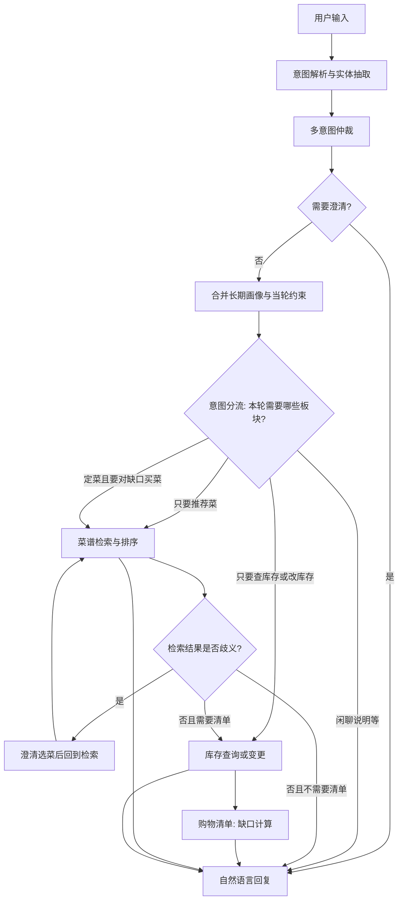

# WHAT-TO-EAT-AGENT 软件需求规格说明书（SRS）

**文档定位**：本文档作为家庭膳食决策与库存管理 Agent 的**需求基线**，用于后续对现有代码的重构、补缺与验收。文中「必须 / 应 / 宜 / 可」分别对应强制性、强烈推荐、建议性、可选能力。

**项目定位**：本项目不是泛化的生活助理，而是一个边界清晰、可复现、可评测的 Agent 任务环境。系统在**本地菜谱库**、**个人饮食约束**与**家庭食材库存**这三个可控状态下，完成「找菜谱 → 锁定权威菜谱 → 解析食材需求 → 比对库存 → 生成购物缺口 / 扣减库存」的任务闭环。

**与现有代码的关系**：仓库内历史实现仅作映射参考；**实现与本文冲突时，以本文为准迭代代码**，除非经变更评审修订本文。

---

## 1 引言

### 1.1 编写目的

- 统一产品、架构与研发对「家庭膳食决策与库存管理 Agent 应交付什么」的认知。
- 为 LangGraph 编排、多意图策略、记忆与数据边界提供**可验收的需求条目**。
- 明确 Agent 的输入、工具、状态、输出与验证方式，避免项目退化为泛化生活助理 demo。
- 降低后续改动时的隐性耦合与口径漂移。

### 1.2 范围

**纳入范围**：

- 面向家庭做饭前后的可控任务闭环：菜谱决策、库存对账、购物缺口与确认后的库存更新。
- 基于自然语言的膳食推荐、菜谱检索与解析。
- 用户饮食偏好与临时健康约束的采集与应用。
- 家庭食材库存的查询与变更（含**确认使用对应菜谱后**的扣减、补货）。
- 依据「菜谱需求 − 库存」的购物缺口清单（含单位换算）。
- 对话式交互下的意图识别、多意图编排、澄清与降级。

**可不纳入首版（需在章节 2 显式裁剪）**：

- 多人家庭角色细分与权限（若未产品化可暂缓）。
- 与第三方电商、线下商超的下单闭环。
- 营养摄入精确追踪（千卡级长期日志）等非对话主线能力。

### 1.3 名词术语

| 术语       | 含义                                |
| -------- | --------------------------------- |
| **R**    | 选定菜谱的结构化食材需求（Recipe requirements） |
| **I**    | 当前库存快照（Inventory snapshot）        |
| **硬约束**  | 违反则不应推荐相关菜品的条件（如过敏原、医嘱禁食）         |
| **软偏好**  | 影响排序与话术但不单独构成禁令的条件（如偏好清淡）         |
| **当轮约束** | 用户本轮口述的短期状态（如肠胃不适），未必写入长期画像       |
| **元意图**  | 澄清、闲聊、帮助等控制对话进程的类型，不单独完成业务闭环      |
| **按需短路** | 按用户目标仅调用必要板块，避免固定流水线              |

### 1.4 需求编号约定

- **FR-xx**：功能需求。
- **NFR-xx**：非功能需求。
- **SR-xx**：状态与数据需求。
- **IR-xx**：接口与集成需求。

---

## 2 总体描述

### 2.1 产品愿景

帮助用户在**本地菜谱库**、**个人饮食约束**与**家中现有食材**条件下，更快决定「吃什么」、确认「能不能做」、必要时给出「缺什么 / 买多少」，并在做饭后形成可追溯的库存更新闭环。

### 2.1.1 Agent 任务环境边界

| 维度 | 需求口径 |
|------|----------|
| **输入** | 用户自然语言请求，例如菜谱推荐、指定菜名检索、库存查询、购物清单索要、补货录入、做饭后扣减库存。 |
| **工具** | MCP 菜谱检索与源文件读取、本地 RAG、菜谱结构化解析、SQLite 用户画像库、SQLite 家庭库存库、单位换算与缺口计算模块。 |
| **状态** | LangGraph 会话状态、任务栈、会话摘要、短期约束、长期画像、锁定菜谱、结构化食材需求 **R**、库存快照 **I**、购物缺口缓存、错误与降级状态。 |
| **输出** | 菜谱候选、澄清问题、权威菜谱解析结果、推荐理由、库存快照、购物缺口清单、补货预览、确认后的库存变更反馈、可解释降级回复。 |
| **验证** | 固定 E2E 用例采集与分层打分，覆盖检索、生成、对话、多意图、库存与购物清单行为。 |

### 2.2 目标用户与会话边界

- **目标用户**：家庭烹饪决策者（单人或代表家庭发言）。
- **无登录（已定稿）**：不提供账号登录；详见 **§2.5**。
- **会话级隔离**：指 **对话编排状态**（如消息、任务队列等）在 LangGraph `thread_id` 维度连续。**持久化业务数据**（尤其是库存）在同一设备上 **跨会话共享**，归属规则见 **§2.5**，不得以会话 id 作为库存主键。

### 2.3 系统边界

系统 **必须** 能通过对话完成：意图理解 →（按需）偏好合并 →（按需）检索/澄清 →（按需）库存与清单 → 自然语言回复。

系统 **不应** 在未获授权策略下将用户健康信息外传；**不应** 虚构库内不存在的菜谱为事实。

### 2.4 设计约束（宜遵守）

- 编排层采用 LangGraph（或等价状态机），节点职责单一、状态单向可追溯。
- 菜谱 **R** 的生成 **必须** 遵守 **§2.6**（MCP 检索文件 → 解析定稿）；RAG **宜** 作辅助召回，详见 §2.6。
- 配置 **应** 具备单一可信来源（避免代码硬编码路径与配置重复键冲突）。

### 2.5 库存归属与账户假设（已定稿）

以下条款作为后续规格设计与库表建模的依据：

| 决策项     | 结论                                                                                       |
| ------- | ---------------------------------------------------------------------------------------- |
| 登录与用户账号 | **不提供**；不对家庭成员做多账号区分                                                                     |
| 设备与家庭   | **单机家庭**：一台设备视为一个家庭单元                                                                    |
| 持久化     | 库存 **必须** 写入 SQLite（或等价嵌入式库）；**依赖磁盘持久化 + 稳定数据库路径** 保证进程退出与设备重启后数据仍在                      |
| 归属键     | 所有库存相关记录 **必须** 带 `**household_id`** 逻辑字段；当前阶段 **全系统固定单值**（如常量 `default`，可从配置读取但默认值仍为单户） |
| 与会话关系   | `**thread_id` 不得作为库存主归属键**；新开会话 **不得** 导致「空冰箱」。会话仅承载对话状态，与库存正交                           |
| 扩展预留    | 若未来引入账号体系，可切换为多 `household_id`；当前实现 **仅需支持单一 household**                                 |

### 2.6 菜谱与结构化食材需求 R 的权威来源（已定稿）

采用 **双阶段**，与 FR-23（不编造库外菜谱为事实）一致：

| 阶段             | 职责                                                                           | 权威性与输出                                             |
| -------------- | ---------------------------------------------------------------------------- | -------------------------------------------------- |
| **阶段一：定位菜谱文件** | 通过 **MCP 提供的检索菜谱文件接口**（及必要时 **RAG 辅助召回/排序**）得到候选或唯一菜谱对应的 **文件标识**（如路径、资源 id） | 本阶段输出 **不得** 单独作为最终 **R**；仅用于锁定「解析哪一份菜谱」           |
| **阶段二：解析定稿**   | 对已锁定菜谱文件执行 **结构化解析**（如 Markdown 分段规则等），生成食材清单 **R**（名称、用量、单位等）               | **R 的唯一权威来源**：仅承认 **解析阶段** 产出的结构化结果；若解析失败则不得伪造完整 R |

**约束**：

- **必须**：购物清单（FR-40～FR-41）、库存扣减建议等依赖 **R** 的链路，**必须** 使用阶段二解析结果（或明确降级：无法解析则告知用户，不按片段臆造用料）。
- **宜**：RAG 用于缩小候选、评分或解释；**禁止** 仅用向量检索片段拼接充当合法 **R**，除非未来单独立项放宽（当前未定稿）。

---

## 3 用户角色与典型场景

### 3.1 用户角色

| 角色       | 描述                |
| -------- | ----------------- |
| **终端用户** | 通过对话使用膳食助手，无管理员权限 |

### 3.2 典型场景（验收故事）

| ID   | 场景                   | 期望                                                     |
| ---- | -------------------- | ------------------------------------------------------ |
| S-01 | 用户说「最近肠胃不好，能吃什么」     | **必须** 将短期约束纳入当轮有效约束；推荐路径宜偏清淡易消化；**不应** 在未澄清情况下主推刺激性菜品 |
| S-02 | 用户只要「推荐一道低脂菜」        | **必须** 完成检索（或澄清）并回复；**不应** 强制拉库存与清单                    |
| S-03 | 用户「想做红烧肉，家里缺什么」      | **必须** 在锁定菜并得到 R 后拉 I，输出缺口清单                           |
| S-04 | 用户「冰箱里还有鸡蛋吗」         | **必须** 仅走库存查询分支即可答复                                    |
| S-05 | 用户一句话包含「推荐清淡菜 + 查鸡蛋」 | **必须** 通过多意图仲裁顺序执行或合并答复，且状态不互相覆盖                       |
| S-06 | 检索多结果且难分             | **必须** 进入澄清，锁定菜之前 **不应** 输出最终购物清单                      |
| S-07 | 用户更新「我对花生过敏，记下来」     | **必须** 写入长期偏好（或显式确认流）；后续检索 **必须** 规避花生                 |
| S-08 | 用户先定菜并得到 R，未索要清单；稍后说「给我购物清单」 | **必须** 直接交付已缓存的缺口结果（在 R、I 未变的前提下）；**不应** 无故重复全量计算而不说明原因 |

---

## 4 业务功能需求

### 4.1 意图理解与对话控制

| ID    | 需求描述                                                                            | 优先级 |
| ----- | ------------------------------------------------------------------------------- | --- |
| FR-01 | 系统 **必须** 将用户每轮输入解析为结构化结果：业务意图（可多标签）、实体、综合置信度、是否需要澄清                            | P0  |
| FR-02 | 系统 **必须** 支持元意图：需澄清、闲聊、使用帮助、超出范围                                                | P0  |
| FR-03 | 当置信度低于可配置阈值时，系统 **应** 进入澄清而非触发检索写库等重动作                                          | P0  |
| FR-04 | 系统 **必须** 输出 `primary_intent` 与有序的 `secondary_intents`（或多意图队列），并定义消费语义（执行一次即出队） | P0  |
| FR-05 | 系统 **不应** 在无澄清结论时同时写入冲突业务状态（例如同时「极辣」与「胃病清淡」落地成同一推荐结论）                           | P0  |

### 4.2 意图体系（产品枚举空间）

以下为 **需求层** 允许的意图类型空间（实现可用精简标签映射）；细分宜保持可标注性。

**元意图**：需澄清、闲聊、使用帮助、超出范围。

**业务意图（按板块）**：

- **偏好**：被动偏好提及；显式画像维护；当轮仅约束。
- **菜谱**：开放式推荐；指名菜谱/食材；替换与调整；做法与知识查阅。
- **库存**：查询；补货录入；**确认使用当前锁定菜谱后**的扣减（宜二次确认写库）。
- **清单**：在 R、I 就绪时**预计算并缓存**缺口；用户显式索要时交付；对话中允许用户**增删改**清单呈现层。
- **横切（可选）**：膳食/营养咨询（可与推荐合并，由实体区分）。

意图与板块 **非一一映射**；同一意图可能顺序跨越多个板块（详见第七章）。

### 4.3 用户偏好与记忆

| ID    | 需求描述                                               | 优先级 |
| ----- | -------------------------------------------------- | --- |
| FR-10 | 系统 **必须** 区分长期画像与当轮临时约束；合并为本轮有效约束 C                | P0  |
| FR-11 | 硬约束 **必须** 在菜谱检索与排序中生效；检索侧无法满足时应说明原因而非静默违规         | P0  |
| FR-12 | 长期画像的写入 **应** 支持被动抽取与显式修正两类策略（修正可覆盖、抽取宜合并）         | P1  |
| FR-13 | 短期状态 **宜** 具备 TTL 或等价失效机制，避免永久污染推荐                 | P1  |
| FR-14 | 会话级摘要与原始消息策略 **应** 与业务状态清场解耦（摘要裁剪 **不应** 默认清空任务现场） | P0  |

### 4.4 菜谱检索与歧义

| ID    | 需求描述                                          | 优先级 |
| ----- | --------------------------------------------- | --- |
| FR-20 | 系统 **必须** 在约束 C 下检索并排序候选菜谱                    | P0  |
| FR-21 | 当唯一高置信结果时，系统 **应** 直接锁定菜并解析结构化 R              | P0  |
| FR-22 | 当多结果且难分或置信不足时，系统 **必须** 进入歧义澄清（有限候选 + 明确选择方式） | P0  |
| FR-23 | 系统 **不应** 编造不在知识库内的具体菜谱为事实                    | P0  |
| FR-24 | 无结果时 **应** 说明原因并可策略性放宽软约束重试（次数可配置）            | P1  |

### 4.5 库存

| ID    | 需求描述                                   | 优先级 |
| ----- | -------------------------------------- | --- |
| FR-30 | 系统 **必须** 提供当前库存快照查询能力                 | P0  |
| FR-31 | 系统 **必须** 支持补货录入与扣减；**扣减仅允许**在用户 **已确认使用（采纳）当前锁定菜谱** 的前提下触发（可与「确认扣库存」合并为一轮话术，但语义上须先绑定菜谱再写库）；宜二次确认或等价安全策略 | P1  |
| FR-32 | 库存写操作失败时 **必须** 显式反馈，**不应** 伪装成功       | P0  |

### 4.6 购物清单

| ID    | 需求描述                                       | 优先级 |
| ----- | ------------------------------------------ | --- |
| FR-40 | 当 **R 已稳定** 且已拉取 **I** 时，系统 **必须** **后台预计算**购物缺口并**写入会话状态缓存**（不要求用户已索要清单） | P0  |
| FR-41 | 缺口计算 **必须** 基于稳定的 R 与 I；无法换算的量 **应** 标注待确认 | P0  |
| FR-42 | 用户**显式**触发清单意图时，系统 **必须优先**返回缓存缺口（若缓存与当前 R、I 一致）；**不应**在用户未索要清单时**以长篇购物清单话术打断**主流程（预计算属静默后台行为） | P0  |
| FR-43 | 用户可在多轮对话中对**清单呈现内容**提出增删改；系统 **必须** 维护可合并的「用户编辑层」并在后续回复中尊重；当 R 或 I 发生实质变化时 **应** 使缓存失效并**可**提示用户是否按新依据重算 | P1  |

### 4.7 多意图编排

| ID    | 需求描述                                         | 优先级 |
| ----- | -------------------------------------------- | --- |
| FR-50 | 多意图 **必须** 遵守优先级：安全/硬约束 > 定菜决策 > 库存动作 > 解释闲聊 | P0  |
| FR-51 | 同一轮内对共享状态的写入 **必须** 串行化；禁止无序并发写导致竞争          | P0  |
| FR-52 | 次意图 **应** 在主意图完成后顺序执行，或按产品策略合并为单条答复          | P1  |

### 4.8 回复生成

| ID    | 需求描述                                     | 优先级 |
| ----- | ---------------------------------------- | --- |
| FR-60 | 最终回复 **必须** 可理解、可操作，并在适用时解释推荐理由与约束依据     | P0  |
| FR-61 | 降级路径（服务不可用、无结果）**必须** 有可解释话术，**不应** 静默失败 | P0  |

### 4.9 记忆子系统（四层模型与编排）

记忆能力与 FR-10～FR-14 配套落地：**会话连续性** 由 LangGraph 与摘要承担；**当轮生效** 与 **跨会话持久化** 必须拆分职责与时序。

#### 4.9.1 上下文管理策略

系统必须能清晰回答「什么保留、什么摘要、什么时候压缩」，并将该策略落实为状态字段与节点职责，而不是将全部历史对话无界塞入 Prompt。

| 问题 | 需求约束 |
|------|----------|
| **什么信息必须一直保留** | 对当前任务正确性有决定作用的结构化事实必须原样保留：`task_stack` / `control_state`、澄清候选、锁定菜谱、菜谱源文件引用、结构化食材需求 **R**、库存快照 **I**、`cached_shopping_gap`、`gap_basis`、`shopping_list_overlay`、库存写入预览与确认状态、错误码与可恢复状态、用户硬约束与仍在 TTL 内的短期约束。 |
| **什么信息可以降级成摘要** | 不再直接驱动工具调用或写库决策的自然语言上下文可以压缩为 L2 摘要，包括已完成的闲聊、推荐理由、解释过程、偏好描述的语义概括、历史问答背景。摘要只提供语义背景，不得替代 **R**、**I**、确认状态、候选列表等权威结构化字段。 |
| **什么时候触发压缩** | 当会话原始消息超过配置阈值 `memory.summary.compress_trigger` 时，摘要节点应压缩窗口外消息，并仅保留最近 `memory.summary.window_size` 条原始消息作为热上下文。任务结束、长回复后或上下文接近预算时也可触发等价压缩，但压缩过程不得清空或重置业务现场。 |

压缩节点 **必须只维护** `messages` 裁剪与 `conversation_summary` 更新；不得默认清空 `task_stack`、`recipe_state`、`inventory_state`、`error_state` 等业务切片。若摘要失败，系统应保留原始热窗口并继续主流程，不得因 L2 压缩失败阻断用户可见回复。

| ID    | 需求描述                                                                                                            | 优先级 |
| ----- | --------------------------------------------------------------------------------------------------------------- | --- |
| FR-15 | 系统 **必须** 采用可区分的记忆层级（至少四层语义）：**L1 原始会话**、**L2 会话摘要**、**L3 当轮生效约束**、**L4 长期画像与带 TTL 的短期画像**；各层载体与生命周期须在实现文档中明确定义 | P0  |
| FR-16 | **L2 会话摘要** 的生成与裁剪 **必须** 独立于业务任务清场：摘要节点 **不应** 默认清空澄清续跑、任务队列等业务现场（与 FR-14 一致）                                  | P0  |
| FR-17 | **L3 当轮约束**（如肠胃不适、感冒需清淡）**必须** 在用户意图进入菜谱检索前合并进本轮有效约束 C；可与规则或小模型提取配合                                             | P0  |
| FR-18 | **L4 长期写入**（被动抽取、显式修正、短期状态入库）**宜** 置于主回复路径之后或异步执行；失败 **不得** 阻断用户收到当期答复（与 NFR-01 一致）                             | P0  |
| FR-19 | 「偏好合并」步骤 **必须** 能组合 **L3 + L4**，并可按需引用 **L2** 摘要语义；合并结果 **必须** 产出统一的有效约束 C 供检索使用                                | P0  |

---

## 5 非功能需求

| ID     | 类别   | 需求描述                                              | 优先级 |
| ------ | ---- | ------------------------------------------------- | --- |
| NFR-01 | 性能   | 纯对话路径 **宜** 具备可配置超时；记忆持久化 **不应** 阻塞首包回复（可异步）      | P1  |
| NFR-02 | 可靠性  | 外部依赖失败 **应** 分级降级；关键失败 **必须** 可观测                 | P0  |
| NFR-03 | 安全隐私 | 健康与饮食数据 **应** 最小化存储；具备修正与追溯字段（时间、来源类型）            | P1  |
| NFR-04 | 可维护  | 意图、状态字段、路由规则 **应** 文档化；禁止隐式跨节点契约                  | P0  |
| NFR-05 | 可测试  | 核心路径 **必须** 具备自动化测试（单测/契约/集成按阶段补齐）                | P0  |
| NFR-06 | 可观测  | **宜** 结构化日志：会话 id、节点名、耗时、错误码、结束原因                 | P1  |
| NFR-07 | 记忆   | 摘要触发率、当轮约束命中率、长期画像写库成功率与 P95 延迟 **宜** 可观测，便于调参与告警 | P2  |
| NFR-08 | 质量评估 | 系统 **应** 支持 **端到端自动化测评** 下的分层质量度量，至少覆盖 **规格 §10.3**：**检索层**（召回率、金标排名、MRR、可选 NDCG@k）、**生成层**（与金标 **R** 的准确性、幻觉率、格式合规）、**对话层**（意图识别准确率、澄清触发率、多轮上下文保持率）；并与 §3.2 场景及 **开发计划 §5** 用例期望可对齐 | P1  |
| NFR-09 | 推理可审 | 系统 **应** 在 E2E 测评中产出 **业务链路树**（意图→槽位→检索→后处理→生成，每步 ✓/✗/—），使评审可定位失败环节；**宜** 另存机器可读轨迹（MCP/节点级）供调试，**不强制**固定历史 `steps[]` schema；**禁止**仅以最终一句表面正确作为通过依据；细则见 **规格 §10.5～10.7** | P1  |
| NFR-10 | 效率     | 系统 **应** 在 E2E 测评中可汇总 **平均响应时间**、**平均 token 消耗**（不可得时标未测）、**工具调用次数**；语义 **宜** 与 NFR-06、T-028 可观测一致，详见 **规格 §10.3.4** | P2  |
| NFR-11 | 评估报告 | 每次 **正式 E2E 测评 run** 完成后，**必须** 生成人类可读的 **测评总报告**（**`docs/agent_eval_report.md`** 或 **`docs/evals/e2e_summary_<run_id>.md`**，以交付定稿为准）；**宜** 同步 `manifest.json`、各 **`case_id` 单用例报告**（含链路树与分项分）及可选 `scores.json`/`latest_eval.json`；**禁止**仅存在不可发现路径而无固定「最新总览」入口；与 **`docs/test_report.md`** 的职责划分见 **规格 §10.6** | P1  |

---

## 6 业务流程与编排需求

### 6.1 固定流水线禁止

系统 **不应** 将「检索 → 歧义 → 库存 → 清单」作为每轮必经固定流水线。**必须** 在意图澄清通过后进行 **意图分流**，仅启用必要板块（按需短路）。

### 6.2 流程示意图

### 6.3 环节说明与异常要点

| 环节           | 职责                        | 异常要点                |
| ------------ | ------------------------- | ------------------- |
| 输入           | 保留上下文                     | 摘要策略勿破坏澄清续跑现场       |
| 意图解析         | 结构化意图与实体                  | 失败则闲聊或单点澄清          |
| 多意图仲裁        | 主次顺序与阻塞                   | 冲突则澄清               |
| 记忆（摘要/当轮/长期） | L2 压缩上下文；L3 当轮约束；L4 后置持久化 | 摘要不误清业务现场；写库失败不挡主回复 |
| 澄清           | 选项化追问                     | 锁定菜前不出最终清单          |
| 偏好合并         | 产出 C（合并 L3+L4，可引用 L2）     | 服务不可用则保守输出          |
| 检索           | 产出候选或 R                   | 无结果可放宽软约束重试         |
| 歧义           | 用户锁定                      | 与多意图挂起策略一致          |
| 库存           | I 与变更                     | 写失败明示               |
| 清单           | R−I；**预计算缓存** + 显式意图交付；用户可编辑呈现层 | R 不稳定不算；R/I 变则失效缓存 |
| 回复           | 交付与解释                     | 降级路径可读              |

---

## 7 状态与数据需求

### 7.1 核心实体

| 实体     | 说明            |
| ------ | ------------- |
| 用户画像   | 长期偏好、禁忌、目标等   |
| 短期状态   | TTL 类临时约束     |
| 菜谱需求 R | 与选定菜谱绑定的结构化食材 |
| 库存 I   | 食材名、数量、单位；会话内规范形态见 §7.2.1（`Dict` 快照） |
| 购物缺口   | 计算结果列表；**会话内缓存**（绑定 R、I 指纹） |
| 清单编辑层 | 用户对清单条目的增删改，与计算结果合并展示   |

### 7.2 Agent 状态模型（目标架构）

**需求**：状态 **应** 分层为清晰切片；每一字段 **应** 单一真相来源；**任务栈** **应** 与路由优先级规则一致（与 FR-04 一致，字段名 **`task_stack`**），避免「名为栈实为集合包含」的歧义。

#### 7.2.1 方案 A：LangGraph `AgentState` 与七切片

与 [`docs/规格设计.md`](规格设计.md) **§1.2.0、§1.2.1** 完全一致（SRS 不重复定义字段表，仅锁定需求口径）：

- **顶层嵌套七键**：`dialog_state`、`memory_state`、`control_state`、`recipe_state`、`inventory_state`、`response_state`、`error_state`，均为会话状态的**一级子对象**。  
- **窄顶层字段**：`active_user_id`（与 `SCOPE_ID` / `household.default_id` 对齐）单独保留在 `AgentState` 顶层，**不属于**上述七切片之一。  
- **库存快照 I**：`inventory_state.inventory_snapshot` **必须**为 **`Dict[str, {"amount": float, "unit": str}]`**，键为规范化食材名；**不得**以 `List[Dict]` 作为 **I** 的规范形态（与购物缺口、单位换算口径一致）。

#### 7.2.2 迁移与兼容（需求级）

- **应** 分阶段将遗留的 `logistics_buffer` 及扁平字段迁入切片，并通过兼容层保持旧 checkpoint / 旧代码可读，直至移除双写。  
- **必须**：新开发逻辑仅以切片为读写界面（与规格「新代码只读写切片语义」一致）。  
- **禁止**：在 `control_state` 中并行使用 `task_queue` 等与 **`task_stack`** 冲突的第二套任务序列命名。

### 7.3 持久化

- 长期画像与短期状态 **应** 持久化至数据库或等价存储。
- 会话消息与摘要 **应** 可通过 LangGraph checkpointer 或等价机制恢复。

### 7.4 记忆子系统分层（设计基线）

| 层级              | 内容                            | 典型载体                                   | 生命周期                   |
| --------------- | ----------------------------- | -------------------------------------- | ---------------------- |
| **L1 原始会话**     | `messages` 等完整对话轨迹            | LangGraph state + checkpointer         | 会话线程内；长度由裁剪/摘要策略控制     |
| **L2 会话摘要**     | `conversation_summary`，承载跨轮要点 | state 字段                               | 会话级；随轮次滚动更新            |
| **L3 当轮生效约束**   | 本轮口述短期健康/饮食限制（如肠胃不好）          | state 专用字段（如 `short_term_constraints`） | 本轮至若干轮；**宜** TTL 或显式失效 |
| **L4 长期与可过期短期** | 过敏原、口味、膳食目标；需 TTL 的短期病状记录     | 业务数据库（如用户画像库）                          | 跨会话；短期记录带过期策略          |

**分层原则**：L3 负责「这句话立刻影响检索」；L4 负责「下次还来仍记得」。**禁止** 将任务栈、澄清候选等业务控制字段塞进 L2 摘要文本替代结构化状态。

### 7.5 组件职责边界

| 组件             | 允许                  | 禁止                    |
| -------------- | ------------------- | --------------------- |
| 会话摘要节点         | 裁剪消息、更新 L2          | 重置任务队列、擅自清空澄清/菜谱业务缓冲区 |
| 当轮约束提取（可选独立节点） | 写入 L3               | 替代意图路由；在未授权策略下写长期库    |
| 长期记忆写入（Keeper） | 读会话与画像、写入 L4、返回写库状态 | 决定主流程路由；失败后阻断主链成功路径   |

### 7.6 写入时机与编排顺序（推荐）

同一轮内推荐顺序如下（实现 **宜** 遵守以降低延迟与错乱风险）：

1. 合并用户新输入至 **L1**（若由编排追加消息）。
2. **L2**：按需执行摘要更新。
3. **L3**：提取并写入当轮约束，确保检索节点可见。
4. 主业务链：路由 → 检索 → … → 生成回复。
5. **L4**：主回复生成完成后执行持久化或异步队列；失败记录日志并可重试。

### 7.7 异常与安全

| 场景              | 要求                                  |
| --------------- | ----------------------------------- |
| 摘要服务失败          | **必须** 保留可用原始消息或降级文本，**不应** 中断主推理链路 |
| Keeper / 画像写库失败 | **必须** 可观测；用户侧 **宜** 可选提示「偏好可能未保存」  |
| 被动抽取与显式修正       | **应** 采用不同合并策略（见 FR-12），避免误覆盖       |
| L3/L4 混淆        | 临时状态 **不应** 在无 TTL 情况下等同长期禁忌写入      |

### 7.8 与需求条目映射

| 本条设计      | 对应需求         |
| --------- | ------------ |
| 四层分离      | FR-15        |
| 摘要与业务清场解耦 | FR-14、FR-16  |
| 当轮约束先于检索  | FR-17、FR-10  |
| 后置持久化     | FR-18、NFR-01 |
| 合并产出 C    | FR-19、FR-11  |
| 短期 TTL    | FR-13        |

---

## 8 接口与集成需求

| ID    | 接口     | 需求                                                                                                          |
| ----- | ------ | ----------------------------------------------------------------------------------------------------------- |
| IR-01 | LLM    | 意图结构化输出、摘要与生成 **应** 可配置模型与超时                                                                                |
| IR-02 | 菜谱数据   | **必须** 遵守 §2.6：`R` 仅来自菜谱文件解析；MCP 检索接口与解析器 **必须** 对上游暴露统一契约（成功/失败、文件标识、解析结果结构一致）；RAG 返回 **不得** 在无解析时冒充最终 `R` |
| IR-03 | 向量检索   | 检索参数与存储路径 **应** 与摄取侧一致，启动 **宜** 自检                                                                          |
| IR-04 | 配置     | **应** 单一来源；禁止静默覆盖                                                                                           |
| IR-05 | 用户画像存储 | 长期画像与短期状态表 **应** 支持幂等更新、显式修正与 TTL；读接口 **应** 可被「偏好合并」与 Keeper 复用                                             |

---

## 9 全局异常与降级矩阵（摘要）

| 场景        | 行为                 |
| --------- | ------------------ |
| 低置信 / 缺实体 | 澄清优先               |
| 偏好与请求冲突   | 澄清或风险提示            |
| 检索为空      | 说明 + 建议换输入         |
| 检索歧义      | 候选澄清               |
| 外部服务超时    | 降级话术 + 可重试         |
| 写库失败      | 明确失败，不冒充成功         |
| 摘要失败      | 保留上下文并继续；不静默清空关键消息 |
| 画像写库失败    | 主回复仍可交付；记录失败并可重试   |

---

## 10 质量与端到端评估需求

本节定义膳食助手「**好不好**」的需求口径，与 **功能是否具备**（FR）互补；**端到端自动化测评** 的流程、**检索/生成/对话/效率** 四层指标、**业务链路树**、产出物与路径以 **[`docs/规格设计.md`](规格设计.md) §10** 为准；任务拆解见 **[`docs/开发计划.md`](开发计划.md) M7、§5～§6、T-040～T-043**。

### 10.1 与测试、缺陷报告的关系

| 文档 / 产物 | 职责 |
| ----------- | --- |
| **`docs/test_report.md`** | 单测/集成结果、缺陷 TR 编号、复现与修复闭环（**测对/测错**） |
| **测评总报告**（`docs/agent_eval_report.md` 或 `docs/evals/e2e_summary_<run_id>.md`，见规格 §10.6） | **E2E 跑批** 后的分层得分、通过率、失败用例索引、与历史 run 可选对比（**好不好**） |
| **单用例报告**（`docs/evals/cases/...`，见规格 §10.6） | 每条用例的链路树、期望 vs 实际、子得分 |
| 单测 / 契约测试 | NFR-05；与 E2E 测评 **并行**，不互相替代 |

### 10.2 E2E 测评流程（验收关注点）

| 步骤 | 需求要点 |
| --- | --- |
| **用例构造** | 按 **场景分类** 维护用例；含多轮输入、`expected`（意图/槽位/金标菜谱/**R**/澄清期望/多轮偏好等）；可与 §3.2 **S-01～S-08** 映射 |
| **执行** | 与线上一致配置调用 Agent；采集检索结果、状态、**R**、回复、耗时、token（若可）、工具调用次数 |
| **对比与打分** | 与 `expected` 自动对比；产出 **检索/生成/对话/效率** 子指标及用例总分（权重可配置，见开发计划 §5.6） |
| **单用例输出** | **必须** 含 **业务链路树**（规格 §10.5，与开发计划 §5.5 同构） |
| **总报告** | 全部用例完成后 **必须** 输出一份总报告（规格 §10.6） |

### 10.3 分层指标（验收关注点，与规格 §10.3 一致）

| 层级 | 需求要点 |
| --- | --- |
| **检索** | **召回率**（金标是否入候选）、**排名**、**MRR**；有相关性标注时 **NDCG@k**，否则标未测 |
| **生成** | **准确性**（与金标 **R** 等）、**幻觉率**（相对 **R**+库事实）、**格式合规** |
| **对话** | **意图识别准确率**、**澄清触发率**（歧义/非歧义用例对照）、**上下文保持率**（多轮忌口/偏好） |
| **效率** | **平均响应时间**、**平均 token**（不可得则未测）、**工具调用次数** |

### 10.4 评估报告与产物（交付物）

- **必须**：每次正式 **E2E 测评 run** 结束后，存在 **测评总报告**（路径见 **规格 §10.6**），且可被评审直接阅读（含分层汇总、均分、失败列表、`run_id`、未测项说明）。  
- **必须**：每条用例有 **单用例报告**，含 **业务链路树** 及分项得分（路径见 **规格 §10.6**）。  
- **宜**：`manifest.json`、`scores.json` 或 `latest_eval.json`，便于 CI 与回归对比。  
- **入口**：测评 runner **须** 独立于产品 `main.py`（与开发计划 §6 末一致）。**Agent 系统端到端测评不得**以 pytest 作为跑批主入口（与仓库单测分层；CI **应**调用独立 CLI / `python -m …`）。

---

## 11 验收标准（阶段）

| 阶段       | 条件                                           |
| -------- | -------------------------------------------- |
| **阶段 A** | S-01～S-04 人工场景通过；核心单测通过                      |
| **阶段 B** | 多意图 S-05、澄清 S-06、偏好写入 S-07、清单缓存 S-08 通过；契约测试覆盖 IR-02   |
| **阶段 C** | NFR 可观测与配置自检落地；记忆四层职责与时序满足 FR-15～FR-19；端到端稳定 |
| **阶段 D（宜）** | NFR-08～NFR-11 与 **规格 §10** 落地：至少一次完整 **E2E 测评 run** 产出可读 **测评总报告** + **单用例报告（含业务链路树）**；**T-040～T-043** 达到「可回归对比」；分层指标覆盖 **本文件 §10.3** 与 **规格 §10.3** 所述四层 |

---

## 12 现有实现差距说明（改进指引，非验收条目）

以下用于研发排期参考，**不作为否定当前仓库的依据**：

- 路由与任务语义可能与「队列消费」不一致时需对齐第七章。
- 记忆节点若混合业务清场需按 FR-14、FR-16 拆分。
- 记忆分层与时序若与 7.4～7.6 不一致，须对齐 FR-15～FR-19 与 NFR-01。
- 固定流水线若存在需按 6.1 改为分流。
- 模块间返回类型不一致需按 IR-02 收敛。
- 若当前实现将 RAG 片段直接当作 `R`，须改为符合 **§2.6** 的双阶段链路。

---

## 13 附录：仓库路径映射（实现着陆点）

| 能力          | 路径                                                                  |
| ----------- | ------------------------------------------------------------------- |
| Agent 状态与编排 | `src/agent/state.py`、`src/agent/workflow.py`                        |
| 意图路由        | `src/agent/nodes/router.py`                                         |
| 检索与 MCP     | `src/agent/nodes/researcher.py`、`src/mcp/`                          |
| 库存与清单       | `src/agent/nodes/logistics.py`、`src/libs/base/inventory.py`         |
| 用户画像与记忆     | `src/agent/nodes/memory_keeper.py`、`src/libs/base/user_profiles.py` |
| RAG         | `src/rag/`                                                          |
| 配置          | `config/setting.yaml`                                               |

---

## 修订记录

| 版本  | 日期         | 说明                                                             |
| --- | ---------- | -------------------------------------------------------------- |
| 1.0 | 2026-05-03 | 首次发布为 SRS，合并原项目说明与意图体系                                         |
| 1.1 | 2026-05-03 | 纳入记忆子系统：四层模型、职责边界、编排时序；新增 FR-15～FR-19、NFR-07、IR-05；扩展 §7.4～7.8 |
| 1.2 | 2026-05-03 | 增加关联文档：开发计划（按 SRS 拆解任务与进度表）                                    |
| 1.3 | 2026-05-03 | 已定稿：无登录、单机家庭；库存归属 `household_id` 单值；会话与库存关系（§2.2、§2.5）         |
| 1.4 | 2026-05-03 | 已定稿：菜谱双阶段——MCP 检索菜谱文件 → 解析得 `R`；更新 §2.6、§2.4、IR-02、意图与槽位（现行见 **规格 §12**） |
| 1.5 | 2026-05-03 | 增加关联文档：规格设计说明书（`docs/规格设计.md`）                                 |
| 1.6 | 2026-05-03 | 缺口预计算缓存 + 显式交付（FR-40～FR-42）；清单编辑层 FR-43；扣减绑定确认使用菜谱（FR-31）；新增 S-08 |
| 1.7 | 2026-05-03 | §7.2：方案 A 七切片 `AgentState` 与 `inventory_snapshot` 字典形态；迁移原则；`task_stack` 唯一命名（对齐规格 §1.2.0） |
| 1.8 | 2026-05-06 | 新增 **§10 质量与端到端评估**；NFR-08～NFR-11；**阶段 D（宜）**；原 §10～§12 顺延为 §11～§13；对齐规格 §10 与开发计划 M7 |
| 1.9 | 2026-05-08 | 新增 **§10.5.1** 场景级自动化测评与全链路可读输出；NFR-11 与阶段 D 对齐 **规格 §10.8**（每场景报告 + 业务链路树与 `steps[]`） |
| 1.10 | 2026-05-08 | **§10 与 NFR-08～11 对齐新版 E2E**：检索/生成/对话/效率四层指标；业务链路树为必选；总报告 + 单用例 `cases/`；删除以旧 **§10.3～10.4 `steps[]`/四分归因** 为主路径的表述；阶段 D 与 **规格 §10**、**开发计划 §5～§6** 同步 |
| 1.11 | 2026-05-08 | **§10.4**：明确 E2E 跑批 **不得**以 pytest 为主入口，与 **开发计划 §5～§6**、**规格 §10.7** 一致 |

**文档维护**：需求变更须更新版本号与修订表；重大变更需同步验收用例。

**相关文档**：

- [`docs/开发计划.md`](开发计划.md)（按本 SRS 拆解的研发任务与工作进度表；**M7**、**§5～§6**、**T-040～T-043** 为 E2E 测评任务与产出约定）
- [`docs/规格设计.md`](规格设计.md)（各板块技术架构、数据结构与逻辑规格；**§10** 为 **E2E 测评** 技术契约：分层指标、链路树、产出路径）
- E2E 测评总报告（实现 **NFR-11** 后）：`docs/agent_eval_report.md` 或 `docs/evals/e2e_summary_<run_id>.md`（与 [`docs/test_report.md`](test_report.md) 职责不同，见 **§10.1**）

